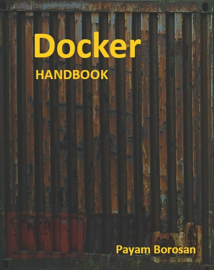

# Introduction

Welcome to Docker handbook.This hand book comes in  handy for two types of people. People  who want to get familiar with docker as fast as possible and people who want to review docker. We are not going to get deep ,it does not cover  Docker Certified associate exam(DCA) syllabus, With that, lets get started!

By Payam Borosan

* Site: [www.linuxcert.ir](http://linuxcert.ir/)
* GitBook: [https://borosan.gitbook.io/docker-handbook/](https://borosan.gitbook.io/docker-handbook/)
* e-mail: p.borosan \[at] gmail.com

Donation :

* coffeete (from IR): [https://www.coffeete.ir/borosan](https://www.coffeete.ir/borosan)
* bitcoin: bc1qhm5nr98su6xupv4dd6zt2m0sq2dzxh69zejm85
* ethereum: 0x6F3D43A6957CC61b74Fe85Ad52D05d91a2B13c67
* litecoin: ltc1qvxu57q2f3ay9tzu6tffkayc65te80vax9wzxn7

