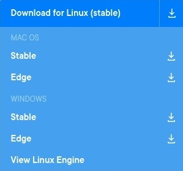

# Basic Concepts

### Containerization

Containerization is the process of encapsulating software code along with all of its dependencies inside a single package so that it can be run consistently anywhere.

### Docker

Docker is an open source containerization platform. It provides the ability to run applications in an isolated environment known as a container.

Containers are like very lightweight virtual machines that can run directly on our host operating system's kernel without the need of a hypervisor. As a result we can run multiple containers simultaneously.


Each container contains an application along with all of its dependencies and is isolated from the other ones. Developers can exchange these containers as image\(s\) through a registry and can also deploy directly on servers.

### Comparing Virtual Machines and Containers


**virtual machines:**

* A virtual machine is the emulated equivalent of a physical computer system with their virtual CPU, memory, storage, and operating system.
* A program known as a hypervisor creates and runs virtual machines. The physical computer running a hypervisor is called the host system, while the virtual machines are called guest systems.
* The hypervisor treats resources — like the CPU, memory, and storage — as a pool that can be easily reallocated between the existing guest virtual machines.

> **There are two types of hypervisors:**
>
> **Type 1 Hypervisor** \(VMware vSphere, KVM, Microsoft Hyper-V\). 
>
> **Type 2 Hypervisor** \(Oracle VM VirtualBox, VMware Workstation Pro/VMware Fusion\).

**Containers:**

* A container is an abstraction at the application layer that packages code and dependencies together. 
* Instead of virtualizing the entire physical machine, containers virtualize the host operating system only.
* Containers sit on top of the physical machine and its operating system. Each container shares the host operating system kernel and, usually, the binaries and libraries, as well.

| What's Diff? | VMs | Containers |
| :--- | :--- | :--- |
| size | Heavyweight \(GB\) | Lightweight\(MB\) |
| BootTime | Startup time in minutes | Startup time in seconds |
| Performance | Limited performance | Native performance |
| OS | Each VM runs in its own OS | All containers share the host OS |
| Runs on | Hardware-level virtualization\(Type1\) | OS virtualization |
| Memory | Allocates required memory | Requires less memory space |
| Isolation | Fully isolated and hence more secure | Process-level isolation, possibly less secure |

### Getting Docker set up and running

#### Choosing which Docker product based on requirements

In a production environment that runs containers hosting critical applications, you would rather have your favorite admins install Docker Enterprise.

However, on your development machine or a continuous integration build machine, you can use the free Docker Engine Community or Docker Desktop depending on your machine type. In short:

| Use | Product |
| :--- | :--- |
| Developer machine | Docker Engine Community or Docker Desktop |
| Small server, small expectations | Docker Engine Community |
| Serious stuff/Critical applications | Docker Engine Enterprise or Kubernetes |

#### Installing Docker

Navigate to the download page for[ Docker Desktop ](https://www.docker.com/products/docker-desktop)and choose your operating system from the drop-down:



#### 

#### Hello World in Docker

Now that we have Docker ready to go on our machines, it's time for us to run our first container. Open up terminal and run following command:

```text
docker run hello-world
```

If everything goes fine you should see some output like the following:

```text
[root@earth ~]# docker run hello-world
Unable to find image 'hello-world:latest' locally
latest: Pulling from library/hello-world
0e03bdcc26d7: Pull complete 
Digest: sha256:49a1c8800c94df04e9658809b006fd8a686cab8028d33cfba2cc049724254202
Status: Downloaded newer image for hello-world:latest

Hello from Docker!
This message shows that your installation appears to be working correctly.

To generate this message, Docker took the following steps:
 1. The Docker client contacted the Docker daemon.
 2. The Docker daemon pulled the "hello-world" image from the Docker Hub.
    (amd64)
 3. The Docker daemon created a new container from that image which runs the
    executable that produces the output you are currently reading.
 4. The Docker daemon streamed that output to the Docker client, which sent it
    to your terminal.

To try something more ambitious, you can run an Ubuntu container with:
 $ docker run -it ubuntu bash

Share images, automate workflows, and more with a free Docker ID:
 https://hub.docker.com/

For more examples and ideas, visit:
 https://docs.docker.com/get-started/

[root@earth ~]# 
```

To understand what just happened, you need to get familiar with the Docker Architecture, Images and Containers, and Registries.

### Docker Engine

Docker Engine is a client-server application with these major components:

* A **server** which is a type of long-running program called a daemon process \(the dockerd command\).
* A **REST API** which specifies interfaces that programs can use to talk to the daemon and instruct it what to do.
* A **command line interface \(CLI\)** client \(the docker command\).


### Docker Architecture

Docker’s architecture is also client-server based. However, it’s a little more complicated than a virtual machine because of the features involved. It consists of four main parts:


1. **Docker Client**: This is how you interact with your containers. Call it the user interface for Docker.
2. **Docker Objects**: These are your main components of Docker: your containers and images. We mentioned already that containers are the placeholders for your software, and can be read and written to. Container images are read-only, and used to create new containers.
3. **Docker Daemon**: A background process responsible for receiving commands and passing them to the containers via command line.
4. **Docker Registry**: Commonly known as Docker Hub, this is where your container images are stored and retrieved.


When you are working with Docker, you use images, containers, volumes, networks; all these are Docker objects.


Don't worry if it looks confusing at the moment. Everything will become much clearer in the upcoming sub-sections.

------------------------------------------------------------------------------------

[https://www.freecodecamp.org/news/the-docker-handbook/](https://www.freecodecamp.org/news/the-docker-handbook/) by [Farhan Hasin Chowdhury](https://www.freecodecamp.org/news/author/farhanhasin/)

[https://www.docker.com/resources/what-container](https://www.docker.com/resources/what-container)

[https://www.backblaze.com/blog/vm-vs-containers/](https://www.backblaze.com/blog/vm-vs-containers/)

[https://cloudacademy.com/blog/docker-vs-virtual-machines-differences-you-should-know/](https://cloudacademy.com/blog/docker-vs-virtual-machines-differences-you-should-know/)

[https://docs.docker.com/get-started/overview/](https://docs.docker.com/get-started/overview/)

[https://wiki.aquasec.com/display/containers/Docker+Containers+vs.+Virtual+Machines](https://wiki.aquasec.com/display/containers/Docker+Containers+vs.+Virtual+Machines)

[https://docs.docker.com/get-started/overview/\#:~:text=These%20namespaces%20provide%20a%20layer,\(PID%3A%20Process%20ID\).](https://docs.docker.com/get-started/overview/#:~:text=These%20namespaces%20provide%20a%20layer,%28PID%3A%20Process%20ID%29.)

.


