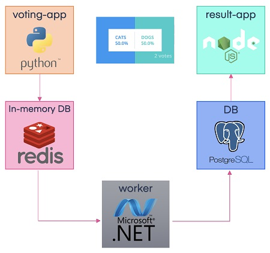
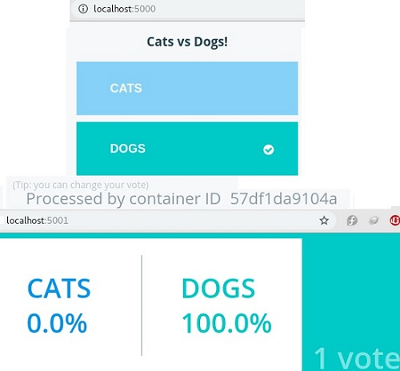
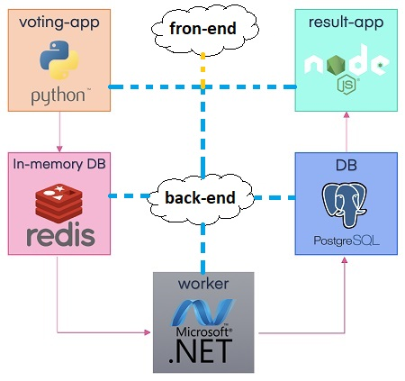

# Docker Compose

We first learned how to run a docker container using the docker run command. What if we need to set up a complex application running multiple services?

### What is Docker compose?

 **Docker Compose** is used to run multiple containers as a single service. For example, lets imagine you have  an application which required NGNIX and MySQL, with docker compose you could create one configuration  file \(_in yaml format_\)  called `dockercompose.yml` which would start both the containers as a service without the need to start each one separately.

A minimal Docker Compose application consists of three components:

1. A `Dockerfile` for each container image you want to build.
2. A YAML file, `docker-compose.yml`, that Docker Compose will use to launch containers from those images and configure their services.
3. The files that comprise the application itself.

### Docker Compose Installation

Compose uses the Docker Engine, so you’ll need to have the Docker Engine installed on your device. You can run Compose on Windows, Mac, and 64-bit Linux. Installing Docker Compose is actually quite easy. On desktop systems, such as Docker Desktop for Mac and Windows, Docker Compose is already included. No additional steps are needed. On Linux systems, you’ll need to:

1. Install the Docker Engine
2. Run the following command to download Docker Compos

```text
sudo curl -L "https://github.com/docker/compose/releases/download/1.26.2/docker-compose-$(uname -s)-$(uname -m)" -o /usr/local/bin/docker-compose
```

   3. Apply permissions to the binary, like so:

```text
sudo chmod +x /usr/local/bin/docker-compose
```

4. Test the installation to check it worked properly

```text
sudo docker-compose --version
docker-compose version 1.26.2, build eefe0d31
```

Now you have Docker Compose downloaded and running properly.

### Example Voting App

For demostration Lets use Docker Sample Voting app which is available in github and you can simply download it from [here](https://github.com/dockersamples/example-voting-app.git) or simple run : `wget https://codeload.github.com/dockersamples/example-voting-app/zip/master`

```text
[root@earth ~]# unzip master.zip 
[root@earth ~]# cd example-voting-app-master
[root@earth example-voting-app-master]# ls -1
architecture.png
docker-compose-javaworker.yml
docker-compose-k8s.yml
docker-compose-simple.yml
docker-compose-windows-1809.yml
docker-compose-windows.yml
docker-compose.yml
docker-stack-simple.yml
docker-stack-windows-1809.yml
docker-stack-windows.yml
docker-stack.yml
ExampleVotingApp.sln
Jenkinsfile
k8s-specifications
kube-deployment.yml
LICENSE
MAINTAINERS
README.md
result
vote
worker
```

 This app is consist of several componenets and uses different technologies:



This simple application will be used to showcase how easy it is to set up an entire application stack consist of different components in docker. But first lets keep aside docker compose and see how we would put this together this application stack using docker run command .

Before starting make sure  that all images of applications are already built are available on Docker local repository, build them using docker build command under related directory:

```text
[root@earth example-voting-app-master]# cd vote/
[root@earth vote]# docker build -t voting-app .
.
.
[root@earth vote]# cd ..
[root@earth example-voting-app-master]# cd result/
[root@earth result]# docker build -t result-app .
.
.
[root@earth vote]# cd ..
[root@earth example-voting-app-master]# cd worker/
[root@earth worker]# docker build -t worker .
.
.
[root@earth example-voting-app-master]# docker image ls
REPOSITORY          TAG                 IMAGE ID            CREATED             SIZE
worker              latest              97fc58e537dc        8 seconds ago       1.72GB
result-app          latest              ac2bada5b913        13 minutes ago      146MB
voting-app          latest              55342be3bf02        23 minutes ago      84.2MB
node                10-slim             645d30ad6e70        5 days ago          135MB
python              2.7-alpine          8579e446340f        3 months ago        71.1MB
microsoft/dotnet    2.0.0-sdk           fde8197d13f4        2 years ago         1.64GB
```

Out of the 5 different components 2 of them redis and postgres images are already available . and now Docker run commads:

> docker run -d --name redis redis
>
> docker run -d --name=vote -p 5000:80 voting-app
>
> docker run -d --name=db -e POSTGRES\_PASSWORD=postgres  postgres:9.4
>
> docker run -d --name=result -p 5001:80 result-app
>
> docker run -d --name=worker worker

It seems good but  it doesn't work! The problem is that we have successfully run all the different containers but we haven't actually linked them together.

We haven't told the voting-app to use this particular redis instance, also we haven't told the worker and the result-app to use this particular PostgresSQL database  that we ran. That is where we use links. **Link** is a command line option which is used to link two containers togehter. 


**How containers find each other?**

By naming containers when running them we can help applications to communicate with each other . For example this piece of code shows how vote app looks for redis db running on a redis container.

```text
[root@earth vote]# cat app.py | grep redis
from redis import Redis
def get_redis():
    if not hasattr(g, 'redis'):
        g.redis = Redis(host="redis", db=0, socket_timeout=5)
    return g.redis
        redis = get_redis()
        redis.rpush('votes', data)
```


In our example to make vote app aware of redis service we add a link option while running the voting app container to link it ti the redis container:

```text
docker run -d --name redis redis
docker run -d --name=vote -p 5000:80 --link redis:redis voting-app
```

Under the hood it creates an entry into the `/etc/hosts` file on the voting app container. It adds an entry with the hostname redis with an internal IP of the redis container. 

and for the worker application we need to add two links:

```text
docker run -d --name=db  -e POSTGRES_PASSWORD=postgres postgres:9.4
docker run -d --name=worker --link db:db --link redis:redis  worker
```

The same thing should be done for the result app to communicate with the database:

```text
docker run -d --name=result -p 5001:80 --link db:db result-app
```

```text
[root@earth ~]# docker ps
CONTAINER ID        IMAGE               COMMAND                  CREATED             STATUS              PORTS                  NAMES
f33904391a77        result-app          "docker-entrypoint.s…"   About an hour ago   Up About an hour    0.0.0.0:5001->80/tcp   result
f96e3486c339        worker              "/bin/sh -c 'dotnet …"   About an hour ago   Up About an hour                           worker
1d2b1a59823a        postgres:9.4        "docker-entrypoint.s…"   About an hour ago   Up About an hour    5432/tcp               db
57df1da9104a        voting-app          "gunicorn app:app -b…"   About an hour ago   Up About an hour    0.0.0.0:5000->80/tcp   vote
aee31cf9dcf9        redis               "docker-entrypoint.s…"   About an hour ago   Up About an hour    6379/tcp               redis
```

now you can open you browser and vote and check the results:




**caution** : Using links this way is depricated and the support may be removed in future!


Once we have docker run command tested and ready it is easy to generate docker compose file from it, but before that lets stop all the previous containers we ran manually.

```text
[root@earth ~]# docker ps
CONTAINER ID        IMAGE               COMMAND                  CREATED             STATUS              PORTS                  NAMES
f33904391a77        result-app          "docker-entrypoint.s…"   2 days ago          Up 2 days           0.0.0.0:5001->80/tcp   result
f96e3486c339        worker              "/bin/sh -c 'dotnet …"   2 days ago          Up 2 days                                  worker
1d2b1a59823a        postgres:9.4        "docker-entrypoint.s…"   2 days ago          Up 2 days           5432/tcp               db
57df1da9104a        voting-app          "gunicorn app:app -b…"   2 days ago          Up 2 days           0.0.0.0:5000->80/tcp   vote
aee31cf9dcf9        redis               "docker-entrypoint.s…"   2 days ago          Up 2 days           6379/tcp               redis
[root@earth ~]# 
[root@earth ~]# docker stop f33 f96 1d2 57d aee
f33
f96
1d2
57d
aee
[root@earth ~]# docker ps
CONTAINER ID        IMAGE               COMMAND             CREATED             STATUS              PORTS               NAMES
[root@earth ~]# 
```

### docker compose file

As we said Compose is a tool for defining and running multi-container Docker applications. With Compose, you use a YAML file to configure your application’s services. Then, with a single command, you create and start all the services from your configuration

Here is a simple Compose file for the voting app sample \(docke-compose-simple.yml has been modified\):

```text
version: "3"

services:
  vote:
    image: voting-app
    command: python app.py
    volumes:
     - ./vote:/app
    ports:
      - "5000:80"

  redis:
    image: redis:alpine
    ports: ["6379"]

  worker:
    image: worker

  db:
    image: postgres:9.4
    environment:
      POSTGRES_USER: "postgres"
      POSTGRES_PASSWORD: "postgres"

  result:
    image: result-app
    command: nodemon server.js
    volumes:
      - ./result:/app
    ports:
      - "5001:80"
      - "5858:5858"

```

### Docker Compose up

and now let bring it up with `docker-compose up` command:

```text
[root@earth example-voting-app-master]# docker-compose -f my-docker-compose-simple.yml up
```

and check the results!

it is possible to see what container are running via `docker-compose ps` command: 

```text
[root@earth example-voting-app-master]# docker-compose ps
               Name                             Command               State                      Ports                    
--------------------------------------------------------------------------------------------------------------------------
example-voting-app-master_db_1       docker-entrypoint.sh postgres    Up      5432/tcp                                    
example-voting-app-master_redis_1    docker-entrypoint.sh redis ...   Up      0.0.0.0:32769->6379/tcp                     
example-voting-app-master_result_1   docker-entrypoint.sh nodem ...   Up      0.0.0.0:5858->5858/tcp, 0.0.0.0:5001->80/tcp
example-voting-app-master_vote_1     python app.py                    Up      0.0.0.0:5000->80/tcp                        
example-voting-app-master_worker_1   /bin/sh -c dotnet src/Work ...   Up                                    
```

before going to the next command lets bring down what we have started by using docker compose:

### Docker Compose Down

```text
[root@earth example-voting-app-master]# docker-compose down
Stopping example-voting-app-master_db_1     ... done
Stopping example-voting-app-master_redis_1  ... done
Stopping example-voting-app-master_result_1 ... done
Stopping example-voting-app-master_vote_1   ... done
Stopping example-voting-app-master_worker_1 ... done
Removing example-voting-app-master_db_1     ... done
Removing example-voting-app-master_redis_1  ... done
Removing example-voting-app-master_result_1 ... done
Removing example-voting-app-master_vote_1   ... done
Removing example-voting-app-master_worker_1 ... done
Removing network example-voting-app-master_front-tier
WARNING: Network example-voting-app-master_front-tier not found.
Removing network example-voting-app-master_back-tier
WARNING: Network example-voting-app-master_back-tier not found.
```

### Docker Compose Build

It is not necessary for Docker Compose to have all required images available in docker registry, as we mentioned 2 of 5 different images are already available on Docker Hub. They are official images from redis and postgres .

 If you like to instruct Docker compose to run Docker Build instead of building images manually we can replace the image inline with a build line and specify the location of a directory which contains the application code and a Dockerfile with instructions to build the docker image \(original docker-compose-sample.yml\):

```text
version: "3"

services:
  vote:
    build: ./vote
    command: python app.py
    volumes:
     - ./vote:/app
    ports:
      - "5000:80"

  redis:
    image: redis:alpine
    ports: ["6379"]

  worker:
    build: ./worker

  db:
    image: postgres:9.4
    environment:
      POSTGRES_USER: "postgres"
      POSTGRES_PASSWORD: "postgres"

  result:
    build: ./result
    command: nodemon server.js
    volumes:
      - ./result:/app
    ports:
      - "5001:80"
      - "5858:5858"
```

first lets remove stopped containers and consequently we can remove images:

```text
[root@earth example-voting-app-master]# docker ps -a
CONTAINER ID        IMAGE               COMMAND                  CREATED             STATUS                           PORTS               NAMES
5742021ff9d8        result-app          "docker-entrypoint.s…"   About an hour ago   Exited (137) About an hour ago                       result
8cfe817181ba        postgres:9.4        "docker-entrypoint.s…"   About an hour ago   Exited (137) About an hour ago                       db
9749002aedde        voting-app          "gunicorn app:app -b…"   About an hour ago   Exited (0) About an hour ago                         vote
fbcbb234ae9a        redis               "docker-entrypoint.s…"   About an hour ago   Exited (0) About an hour ago                         redis

[root@earth example-voting-app-master]# docker container prune 
WARNING! This will remove all stopped containers.
Are you sure you want to continue? [y/N] y
Deleted Containers:
5742021ff9d83f845d9b6cbac362b88aec0da9a2ad0451572ff44ef6527a8599
8cfe817181bac2b461d873a2cd0cd8b33d685dfe937dfd77929ad104cafbb38a
9749002aedded02709cfa7f041a5e5202d5e2164861a0986bdab86c57032004e
fbcbb234ae9acc395e38d195369f035e98feed9b037831f699011853c7132a8a

Total reclaimed space: 306kB
```

```text
[root@earth example-voting-app-master]# docker rmi example-voting-app-master_worker result-app voting-app
Untagged: example-voting-app-master_worker:latest
Deleted: sha256:79b676d6b36e03b13200e45049a618a08677227c8c76f683dd3f0258f2d7711f.
.
.
Untagged: result-app:latest
Deleted: sha256:3c0ca14016af3e9a3d52798b117ec52f425ba9966d5046440949edc82c38403b
Deleted: sha256:18133a50b0c1ae094ddd41c276c340064efce2a2a131a28030d7b5789a525874
.
.
Untagged: voting-app:latest
Deleted: sha256:ee6d47fae4b78a8f8da8d586cd3f6387f131dda5c1220e6865eac704545e013f
.
.
[root@earth example-voting-app-master]# 

```

This time when you run `docker compose up` command, it will  first  build the images give a temporary name for it and then use those images to run containers:

```text
[root@earth example-voting-app-master]# docker-compose -f docker-compose-simple.yml up
```

and check the results in your browser!

### Docker Compose Versions

 The Compose file  defining services, networks, and volumes for a Docker application.Docker compose file  changes over time and many new options is added into it as time passes. So many versions of Docker composes exist.

There could be many reasons why someone would want to use older compose versions. It could either be because they are still using older Docker versions or they already have compose files that are currently in use. Lets take a look at  famous [votingapp](https://github.com/docker/example-voting-app) in all 3 formats to capture the differences:



Following is the votingapp in compose v1 format. 

This version had a number of limitations for example it we wanted to deploy containers on a different network other than the default bridge network there was no way! Also it was imposible to define starting order of containers

```text
redis:
    image: redis
db:
    image: postgres:9.4
vote:
    image: voting-app
    ports:
        - 5000:80
    links:
        - redis
```

Following command could be used to deploy:

`docker-compose up -d`



With version 2 the format of file also changed a little bit. We no longer specify our stack information directly as we did in version 1, instead of that, all information are encapsulated in the service section. So we have to create a property called services in the root of the file and then move  all the services underneath that.

Another different is networking, in version 1 Docker Compose attaches all the containers it runs to the default bridge network and then used links to enable communication between them. With version 2 Docker Compose automatically creates a dedicated bridge network for each application and then attaches all containers to that new network, all containers are then able to communicate to each other using each others's service name.

> So basically there is no need to use links in version 2.

`depends` option also get  introduced  in version 2, so we can specify the starting order of containers by using that:

```text
version: 2
services:

    redis:
        image: redis
    db:
        image: postgres:9.4
    vote:
        image: voting-app
        ports:
            - 5000:80
        depends_on:
            - redis
            
```

We will still use the same docker-compose up command:

`docker-compose up -d`



As of today version 3 is the latest version and its structure is similar to version 2. 

Version 3 comes with support for Docker swarm and there are some options were removed and added

```text
version: 3
services:

    redis:
        image: redis
    db:
        image: postgres:9.4
    vote:
        image: voting-app
        ports:
            - 5000:80
        
        
```

There are 2 ways to deploy an application in compose v3 format. 

1. The first is the traditional option using docker-compose.

`docker-compose up -d`

The above option ignores the parameters under deploy section.

   2. The second preferred option is to use “docker stack” approach as shown below. With this, the Docker services gets directly deployed in the Swarm mode cluster.

`docker stack deploy --compose-file  vote`



### Docker Compose Network 

Previously in  voting app example we have just deployed all containers on the default bridge netwrok,  we can also modify this structure to manage traffic based on the different sources they come from. For example we can separate the user generated traffic from the applications internal  traffic. 



So we create front end network dedicated for user traffic and a back end network dedicated for applications. next We connect each container to the right network \(docker-compose.yml\):

```text
version: "3"

services:
  vote:
    build: ./vote
    command: python app.py
    volumes:
     - ./vote:/app
    ports:
      - "5000:80"
    networks:
      - front-tier
      - back-tier

  result:
    build: ./result
    command: nodemon server.js
    volumes:
      - ./result:/app
    ports:
      - "5001:80"
      - "5858:5858"
    networks:
      - front-tier
      - back-tier

  worker:
    build:
      context: ./worker
    depends_on:
      - "redis"
      - "db"
    networks:
      - back-tier

  redis:
    image: redis:alpine
    container_name: redis
    ports: ["6379"]
    networks:
      - back-tier

  db:
    image: postgres:9.4
    container_name: db
    environment:
      POSTGRES_USER: "postgres"
      POSTGRES_PASSWORD: "postgres"
    volumes:
      - "db-data:/var/lib/postgresql/data"
    networks:
      - back-tier

volumes:
  db-data:

networks:
  front-tier:
  back-tier:
```

again before using `docker-compose up` command first use `docker-compose stop` and `docker container prune` to remove previously deployed images.

```text
[root@earth example-voting-app-master]# docker-compose up
Creating network "example-voting-app-master_front-tier" with the default driver
Creating network "example-voting-app-master_back-tier" with the default driver
Creating db                                 ... done
Creating example-voting-app-master_vote_1   ... done
Creating example-voting-app-master_result_1 ... done
Creating redis                              ... done
Creating example-voting-app-master_worker_1 ... done
.
.
.
```

that's all!

.

.

---

With the special thanks of Mumshad Mannambeth.

[https://www.tutorialspoint.com/docker/docker\_compose.htm](https://www.tutorialspoint.com/docker/docker_compose.htm)

[https://www.infoworld.com/article/3254689/docker-tutorial-get-started-with-docker-compose.html](https://www.infoworld.com/article/3254689/docker-tutorial-get-started-with-docker-compose.html)

[https://www.educative.io/blog/docker-compose-tutorial](https://www.educative.io/blog/docker-compose-tutorial)

[https://miro.medium.com/max/3116/1\*jLReq3Ng6RhqzJo4kBPnpA.png](https://miro.medium.com/max/3116/1*jLReq3Ng6RhqzJo4kBPnpA.png)

[https://docs.docker.com/compose/compose-file/compose-versioning/](https://docs.docker.com/compose/compose-file/compose-versioning/)

[https://sreeninet.wordpress.com/2017/03/28/comparing-docker-compose-versions/](https://sreeninet.wordpress.com/2017/03/28/comparing-docker-compose-versions/)

.


