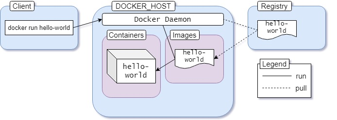

# Docker Containers

## Docker **Images**

An _image_ is a read-only template with instructions for creating a Docker container. Often, an image is _based on_ another image, with some additional customization. For example, you may build an image which is based on the `ubuntu` image, but installs the Apache web server and your application, as well as the configuration details needed to make your application run.

## Docker registries

A Docker _registry_ stores Docker images. Docker Hub is a public registry that anyone can use, and Docker is configured to look for images on Docker Hub by default. You can even run your own private registry.

When you use the `docker pull` or `docker run` commands, the required images are pulled from your configured registry. When you use the `docker push` command, your image is pushed to your configured registry.

#### The Full Picture

Now that you're familiar with the architecture, images, containers, and registries, you're ready to understand what happened when we executed the `docker run hello-world` command.

 The [hello-world](https://hub.docker.com/_/hello-world) image is an example of minimal containerization with Docker. It has a single [hello.c](https://github.com/docker-library/hello-world/blob/master/hello.c) file responsible for printing out the message you're seeing on your terminal. Almost every image contains a default command. In case of the hello-world image, the default command is to execute the _hello_ binary compiled from the previously mentioned C code.

 A graphical representation of the process is as follows:



The entire process happens in five steps:

1. We execute the docker run hello-world command. 
2. Docker client tells the daemon that we want to run a container using the hello-world image. 
3. Docker daemon pulls the latest version of the image from the registry. 
4. Creates a container from the image. Runs the newly created container.

 It's the default behavior of Docker daemon to look for images in the hub, that are not present locally. But once an image has been fetched, it'll stay in the local cache. So if you execute the command again, you won't see the following lines in the output:

```text
Unable to find image 'hello-world:latest' locally
latest: Pulling from library/hello-world
0e03bdcc26d7: Pull complete 
Digest: sha256:49a1c8800c94df04e9658809b006fd8a686cab8028d33cfba2cc049724254202
Status: Downloaded newer image for hello-world:latest
```

If there is a newer version of the image available, the daemon will fetch the image again. That :latest is a tag. Images usually have meaningful tags to indicate versions or builds. You'll learn about this in more detail in a later section.

## Manipulating Containers

In the previous section, we've had an introduction about  Docker client. As we mentioned, It is the command-line interface program that takes our commands to the Docker daemon.Now , you'll learn about more advanced ways of manipulating containers in Docker.

### Running Containers

In the previous section, we've used docker run to **create** and **run** a container using the hello-world image. The generic syntax for this command is:

```text
docker run <image name>
```

Here `image name` can be any image from Docker Hub or our local machine. I hope that you've noticed that I've been saying create and run and not just run, the reason behind that is the docker run command actually does the job of two separate docker commands. They are:

1. `docker create  <image name>` creates a container from given image and returns the container id. 
2. `docker start <image name>`  starts a container by given id of a already created command.

To create a container from the hello-world image execute the following command:

```text
[root@earth ~]# docker create hello-world
c41d97e867380b372f56d4801e9e83b2b528da17792c390b4825bbb2289f9bcf
```

The command should output a long string like  this is the container id. `c41d97e867380b372f56d4801e9e83b2b528da17792c390b4825bbb2289f9bcf` This id can be used to start the built container.


The first 3 or 4  characters of the container id are enough for identifying the container. Instead of using the whole string, using `c41d97e867` should be fine.


To start this container execute the following command:

```text
[root@earth ~]# docker start c41d97e867 
c41d97e867 
```

What happened here is we didn't attach our terminal to the output stream of the container. UNIX and LINUX commands usually open three I/O streams when run, namely STDIN, STDOUT, and STDERR.


If you want to learn more, read this article about this topic:[https://borosan.gitbook.io/lpic1-exam-guide/1034-use-streams-pipes-and-redirects](https://borosan.gitbook.io/lpic1-exam-guide/1034-use-streams-pipes-and-redirects)


To attach your terminal to the output stream of the container you have to use the `-a` or `--attach` option:

```text
[root@earth ~]# docker start c41d97e86 -a

Hello from Docker!
This message shows that your installation appears to be working correctly.

To generate this message, Docker took the following steps:
 1. The Docker client contacted the Docker daemon.
 2. The Docker daemon pulled the "hello-world" image from the Docker Hub.
    (amd64)
 3. The Docker daemon created a new container from that image which runs the
    executable that produces the output you are currently reading.
 4. The Docker daemon streamed that output to the Docker client, which sent it
    to your terminal.

To try something more ambitious, you can run an Ubuntu container with:
 $ docker run -it ubuntu bash

Share images, automate workflows, and more with a free Docker ID:
 https://hub.docker.com/

For more examples and ideas, visit:
 https://docs.docker.com/get-started/

[root@earth ~]# 
```

### Listing Containers

To see  list of the running containers use `docker ps` command :

```text
[root@earth ~]# docker ps
CONTAINER ID        IMAGE               COMMAND             CREATED             STATUS              PORTS               NAMES
```

you'll see that the container has run and exited successfully ! why ?


Unlike virtualmachines containers are not meant to host an Operating System, containers are meant to run specific task or process.\(such as running an application server or web server or simply doing some computing tasks\). Once the task is completed the container exits.

**"A container only lives as long as the process inside it alive"**


in our hello-world  container example, container exits as soon as   [hello.c](https://github.com/docker-library/hello-world/blob/master/hello.c) file printing out the message. 

The `-a` or `--all` option indicates that we want to see not only the running containers but also the stopped ones. Executing ps without the -a option will list out the running containers only.

```text
[root@earth ~]# docker ps -a
CONTAINER ID        IMAGE               COMMAND             CREATED             STATUS                      PORTS               NAMES
c41d97e86738        hello-world         "/hello"            About an hour ago   Exited (0) 10 minutes ago                       flamboyant_allen
```

### Restarting Containers

We've already used the `start` command to run a container. There is another command for starting containers called `restart`. Though the commands seem to serve the same purpose on the surface, they have a slight difference.

The `start` command starts containers that are not running. The `restart` command, however, kills a running container and starts that again. If we use restart with a stopped container then it'll function just as same as the start command.

### Cleaning Up Dangling Containers

Containers that have exited already, remain in the system. These dangling or unnecessary containers take up space and can even create issues at later times.

There are a few ways of cleaning up containers. If we want to remove a container specifically, we can use the `rm` command. Generic syntax for this command is as follows:

```text
docker rm <container id>
```

### Running Containers in Interactive Mode

So far we've only run containers built from the hello-world image. The default command for hello-world image is to execute the single hello.c program that comes with the image.

All images are not that simple. Images can encapsulate an entire operating system inside them. Linux distributions such as Ubuntu, Fedora, Debian all have official Docker images available in the hub.

We can run Ubuntu inside a container using the official ubuntu image. If we try to run an Ubuntu container by executing `docker run ubuntu` command, we'll see nothing happens. But if we execute the command with `-it` option as follows:

```text
[root@earth ~]# docker run -it ubuntu 
root@1f2229e0a867:/# 
```

We should land directly on bash inside the Ubuntu container. In this bash window, we'll be able to do tasks, that we usually do in a regular Ubuntu terminal:

```text
root@1f2229e0a867:/# cat /etc/os-release 
NAME="Ubuntu"
VERSION="20.04 LTS (Focal Fossa)"
ID=ubuntu
ID_LIKE=debian
PRETTY_NAME="Ubuntu 20.04 LTS"
VERSION_ID="20.04"
HOME_URL="https://www.ubuntu.com/"
SUPPORT_URL="https://help.ubuntu.com/"
BUG_REPORT_URL="https://bugs.launchpad.net/ubuntu/"
PRIVACY_POLICY_URL="https://www.ubuntu.com/legal/terms-and-policies/privacy-policy"
VERSION_CODENAME=focal
UBUNTU_CODENAME=focal
```

The reason behind the necessity of this `-it` option is that the Ubuntu image is configured to start bash upon startup. Bash is an interactive program – that means if we do not type in any commands, bash won't do anything.

To interact with a program that is inside a container, we have to let the container know explicitly that we want an interactive session.

The `-it` option sets the stage for us to interact with any interactive program inside a container. This option is actually two separate options mashed together.

* The `-i` option connects us to the input stream of the container, so that we can send inputs to bash. 
* The `-t` option makes sure that we get some good formatting and a native terminal like experience. 

We need to use the -it option whenever we want to run a container in interactive mode.


We can not run any random container in interactive mode. To be eligible for running in interactive mode, the container has to be configured to start an interactive program on startup. Shells, REPLs, CLIs, and so on are examples of some interactive programs.


> To exit use ctrl+c or close the terminal and the container will be stopped.

#### Append a command

Sometimes we need to run a container and meanwhile append a command inside that, for example To see a list of all directories inside the Ubuntu container, you can pass the ls command as an argument:

```text
[root@earth ~]# docker run ubuntu ls
bin
boot
dev
etc
home
lib
lib32
lib64
libx32
media
mnt
opt
proc
root
run
sbin
srv
sys
tmp
usr
var
```

Notice that we're not using the -it option, because we don't want to interact with bash, we just want the output. We can pass any valid bash command as arguments. Like passing the pwd command as an argument will return the present working directory.

> The list of valid arguments usually depends on the entry-point program itself. If the container uses the shell as entry-point, any valid shell command can be passed as arguments. If the container uses some other program as the entry-point then the arguments valid for that particular program can be passed to the container.

### Running Containers in Detached Mode

To keep the container running, you have to keep your terminal window open \(which is meaningless\). 

You can run these kind of containers in detached mode. Containers running in detach mode run in the background like a service. To detach a container, we can use the `-d` or `--detach` option. To run the container in detached mode, execute the following command:

```text
docker run -d redis 
```

You should get the container id as output.

### Executing Commands Inside a Running Container

Now that you have a Redis server running in the background, assume that you want to perform some operations using the redis-cli tool. You can not just go ahead and execute docker run redis redis-cli. The container is already running.

For situations like this, there is a command for executing other commands inside a running container called exec, and the generic syntax for this command is as follows:

```text
docker exec <container id> <command>
```

If the id for the Redis container is 970f1a18714a then the command should be as follows:

```text
[root@earth ~]# docker exec -it 970f1a18714a redis-cli 
127.0.0.1:6379>
```

Notice we're using the -it option as this is going to be an interactive session. Now you can run any valid Redis command in this window and the data will be persisted in the server.

> You can exit simply by pressing ctrl+p + ctrl+q  key combination or closing the terminal window. Keep in mind however, the server will keep running in the background even if you exit out of the CLI program.


**Starting Shell Inside a Running Container**

If you  want to use the shell inside a running container for some reason. You can do that by just using the `exec` command with `sh` being the executable like the following command:

```
docker exec -it <container id> sh
```


### Stopping or Killing a Running Container 

Containers running in the foreground can be stopped by simply closing the terminal window or hitting ctrl + c key combination. Containers running in the background, however, can not be stopped in the same way.

There are two commands for stopping a running container:

* `docker stop  <container id>`  attempts to stop the container gracefully by sending a SIGTERM signal to the container. If the container doesn't stop within a grace period, a SIGKILL signal is sent. 
* `docker kill  <container id>`  stops the container immediately by sending a SIGKILL signal. A SIGKILL signal can not be ignored by a recipient. 


If you want to learn more, read this article about this topic: [https://borosan.gitbook.io/lpic1-exam-guide/1035-create-monitor-and-kill-processes](https://borosan.gitbook.io/lpic1-exam-guide/1035-create-monitor-and-kill-processes)


To stop a container with id `bb7fadc33178` execute docker stop `bb7fadc33178` command. Using `docker kill bb7fadc33178` will terminate the container immediately without giving a chance to clean up.


if you want to exit from a container without killing that  Type Ctrl + p then Ctrl + q.


### Accessing Logs From a Running Container

We can also use the `logs` command to retrieve logs from a running container. The generic syntax for the command is as follows:

```text
docker logs <container id>
```

for example our redis container id is `970f1a18714a ,` in order to access the logs from the container:

```text
[root@earth ~]# docker logs 970f1a18714a
1:C 22 Jul 2020 11:32:40.404 # oO0OoO0OoO0Oo Redis is starting oO0OoO0OoO0Oo
1:C 22 Jul 2020 11:32:40.404 # Redis version=6.0.6, bits=64, commit=00000000, modified=0, pid=1, just started
1:C 22 Jul 2020 11:32:40.404 # Warning: no config file specified, using the default config. In order to specify a config file use redis-server /path/to/redis.conf
1:M 22 Jul 2020 11:32:40.405 * Running mode=standalone, port=6379.
1:M 22 Jul 2020 11:32:40.405 # WARNING: The TCP backlog setting of 511 cannot be enforced because /proc/sys/net/core/somaxconn is set to the lower value of 128.
1:M 22 Jul 2020 11:32:40.405 # Server initialized
1:M 22 Jul 2020 11:32:40.405 # WARNING overcommit_memory is set to 0! Background save may fail under low memory condition. To fix this issue add 'vm.overcommit_memory = 1' to /etc/sysctl.conf and then reboot or run the command 'sysctl vm.overcommit_memory=1' for this to take effect.
1:M 22 Jul 2020 11:32:40.405 # WARNING you have Transparent Huge Pages (THP) support enabled in your kernel. This will create latency and memory usage issues with Redis. To fix this issue run the command 'echo never > /sys/kernel/mm/transparent_hugepage/enabled' as root, and add it to your /etc/rc.local in order to retain the setting after a reboot. Redis must be restarted after THP is disabled.
1:M 22 Jul 2020 11:32:40.405 * Ready to accept connections

```

This is just a portion from the log output. We can get the logs in real-time by using the `-f` or `--follow` option and Any later log will show up instantly in the terminal. We can exit by pressing `ctrl+c` key combination or simply closing the window. The container will keep running even if you exit out of the log window.

### Importing and exporting Containers

For ease of transport, we'll be exporting the containers into a gzipped file. The command to export the containers is:

```text
docker export <ContainerName> | gzip > NAME.gz
```

In similar fashion to the export, we're going to import the container with a single command. Obviously, before you do this, you must first move the exported file to the new server. the import can be handled with the following command:

```text
zcat NAME.gz | docker import - NAME
```

okey lets go to the next section!

.

--------------------

[https://docs.docker.com/get-started/overview/\#:~:text=These%20namespaces%20provide%20a%20layer,\(PID%3A%20Process%20ID\).](https://docs.docker.com/get-started/overview/#:~:text=These%20namespaces%20provide%20a%20layer,%28PID%3A%20Process%20ID%29.)

[https://www.freecodecamp.org/news/the-docker-handbook/](https://www.freecodecamp.org/news/the-docker-handbook/) by [Farhan Hasin Chowdhury](https://www.freecodecamp.org/news/author/farhanhasin/)

.

