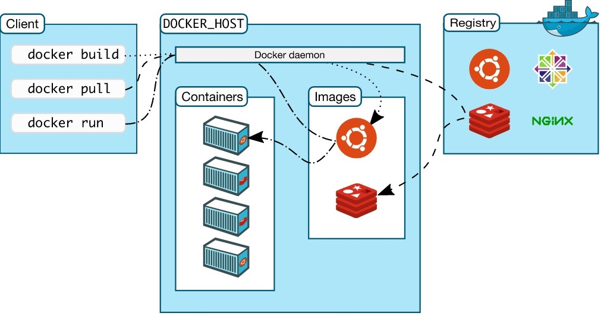

# Docker Images

## What's a docker image?

An image is an executable package that includes everything needed to run an application - the code, a runtime, libraries, environment, variables, and configuration file.

> A container is a runtime instance of an image.


## container images are big

Container images can be pretty big \(though some are really small, like alpine linux is 2.5MB\). Ubuntu 16.04 is about 27MB, and the Anaconda Python distribution is 800MB to 1.5GB.

Every container you start with an image starts out with the same blank slate, as if it made a copy of the image just for that container to use. But for big container images, like that 800MB Anaconda image, making a copy would be both a waste of disk space and pretty slow. So Docker doesn’t make copies – instead it uses layering technique called overlay.

## how overlays work

Overlay filesystems, also known as “union filesystems” or “union mounts” let you mount a filesystem using 2 directories: a “lower” directory, and an “upper” directory.

Basically:

* the **lower** directory of the filesystem is read-only
* the **upper** directory of the filesystem can be both readable and writable

When a process **reads** a file, the overlayfs filesystem driver looks in the upper directory and reads the file from there if it’s present. Otherwise, it looks in the lower directory.

When a process **writes** a file, overlayfs will just write it to the upper directory.

## Understanding Layering with Docker Images

Images are made up of multiple read-only layers. Multiple containers are typically based on the same image. When an image is instantiated into a container, a top writable layer is created. \(which is deleted when the container is removed\)


Docker uses [storage drivers](https://app.gitbook.com/@borosan/s/docker-handbook/~/drafts/-MMo8-UiUbJcyYStxPyk/docker-storage-and-volumes#docker-storage-drivers) to manage the content of the image layers and the writable container layer.Each storage driver handles the implementation differently, but all drivers use stackable image layers and the copy-on-write\(CoW\) strategy.


## The copy-on-write \(CoW\) strategy <a id="the-copy-on-write-cow-strategy"></a>

Copy-on-write is a strategy of sharing and copying files for maximum efficiency. If a file or directory exists in a lower layer within the image, and another layer \(including the writable layer\) needs read access to it, it just uses the existing file. The first time another layer needs to modify the file \(when building the image or running the container\), the file is copied into that layer and modified. This minimizes I/O and the size of each of the subsequent layers.


## The storage location of Docker images and containers <a id="the-storage-location-of-docker-images-and-containers"></a>

A Docker container consists of network settings, volumes, and images. The location of Docker files depends on your operating system. Here is an overview for the most used operating systems:

* Ubuntu: `/var/lib/docker/`
* Fedora: `/var/lib/docker/`
* Debian: `/var/lib/docker/`
* Windows: `C:\ProgramData\DockerDesktop`
* MacOS: `~/Library/Containers/com.docker.docker/Data/vms/0/`

use `docker info | grep -i root` command to findout:

```text
[root@earth ~]# docker info | grep -i root
Docker Root Dir: /var/lib/docker
```

## Docker File

You might create your own images or you might only use those created by others and published in a registry. To build your own image, you create a _Dockerfile_ with a simple syntax for defining the steps needed to create the image and run it. Each instruction in a Dockerfile creates a layer in the image. When you change the Dockerfile and rebuild the image, only those layers which have changed are rebuilt. This is part of what makes images so lightweight, small, and fast, when compared to other virtualization technologies. A Dockerfile is executed by the docker build command



Lets take a look at sample Dockerfile:

```text
#Nginx
#
# VERSION    0.0.1
FROM    ubuntu
LABEL Description="test image" Vendor="ACME Products"
RUN apt-get update && apt-get install -y nginx openssh-server
```

### Dockerfile instructions:

* **FROM**: defines the base image; the FROM instruction must be the first instruction in Dockerfile.
* **LABEL**: it's a Description about any thing you want to define about this image, 
* **ADD**: copies a file into the image but supports tar and remote URL
* **COPY**: copy files into the image, preferred over ADD.
* **VOLUME**: creates a mount point as defined when the container is run.
* **ENTRYPOINT**: the executable runs when the container is run.
* **EXPOSE**: documents the ports that should be published.
* The **CMD** instruction has three forms:

  * **`CMD ["executable","param1","param2"]`** \(_exec_ form, this is the preferred form\)
  * **`CMD ["param1","param2"]`** \(as _default parameters to ENTRYPOINT_\)
  * **`CMD command param1 param2`** \(_shell_ form\)

  _There can only be one `CMD` instruction in a `Dockerfile`. If you list more than one `CMD` then only the last `CMD` will take effect._

* **ENV**: used to define environmental variables in the container.
* **MAINTAINER**: \(while deprecated\), MAINTAINER is used to document the author of the Dockerfile \(typically an email address\)
* **ONBUILD**: only used as a trigger when this image is used to build other images; will define commands to run "on build"
* **RUN**:  runs a new command in a new layer.
* **WORKDIR**: defines the working directory of the container.

Now to build an image from this Dockerfile, we'll use the build command. The generic syntax for the command is as follows:

```text
docker build <build context>
```

The build command requires a Dockerfile and the build's context. The context is the set of files and directories located in the specified location. Docker will look for a Dockerfile in the context and use that to build the image.

Open up a terminal window inside that directory and execute the following command:

```text
[root@earth sandbox]# ls
Dockerfile

[root@earth sandbox]#docker build .
```


Do not use your root directory, `/`, as the `PATH` as it causes the build to transfer the entire contents of your hard drive to the Docker daemon.


We're passing `.` as the build context which means the current directory. If you put the Dockerfile inside another directory like /src/Dockerfile, then the context will be `./src`. The build process may take some time to finish:

```text
[root@earth sandbox]# docker build .
Sending build context to Docker daemon  14.85kB
Step 1/3 : FROM ubuntu
 ---> adafef2e596e
Step 2/3 : LABEL Description="test image" Vendor="ACME Products"
 ---> Running in 043a4ae90eb9
Removing intermediate container 043a4ae90eb9
 ---> bdeb04e9a931
Step 3/3 : RUN apt-get update && apt-get install -y nginx openssh-server
 ---> Running in ae0d0c698212
Get:1 http://archive.ubuntu.com/ubuntu focal InRelease [265 kB]
Get:2 http://security.ubuntu.com/ubuntu focal-security InRelease [107 kB]
Get:3 http://archive.ubuntu.com/ubuntu focal-updates InRelease [111 kB]
Get:4 http://archive.ubuntu.com/ubuntu focal-backports InRelease [98.3 kB]
Get:5 http://archive.ubuntu.com/ubuntu focal/universe amd64 Packages [11.3 MB]
Get:6 http://security.ubuntu.com/ubuntu focal-security/main amd64 Packages [187 kB]
Get:7 http://security.ubuntu.com/ubuntu focal-security/multiverse amd64 Packages [1078 B]
.
.
.
Successfully built fc32da11d651
```

If everything goes fine, you should see something like `Successfully built fc32da11d651` at the end. This random string is the image id and not container id. try `docker image inspect <image id>` to get information about this image , also to see layers which our image includes try `docker image history <image id>` :

```text
[root@earth sandbox]# docker image history fc32
IMAGE               CREATED             CREATED BY                                      SIZE                COMMENT
fc32da11d651        53 seconds ago      /bin/sh -c apt-get update && apt-get install…   159MB               
bdeb04e9a931        2 minutes ago       /bin/sh -c #(nop)  LABEL Description=test im…   0B                  
adafef2e596e        2 weeks ago         /bin/sh -c #(nop)  CMD ["/bin/bash"]            0B                  
<missing>           2 weeks ago         /bin/sh -c mkdir -p /run/systemd && echo 'do…   7B                  
<missing>           2 weeks ago         /bin/sh -c set -xe   && echo '#!/bin/sh' > /…   811B                
<missing>           2 weeks ago         /bin/sh -c [ -z "$(apt-get indextargets)" ]     1.01MB              
<missing>           2 weeks ago         /bin/sh -c #(nop) ADD file:cf87af1f0e27aa6ff…   72.9MB
```

## Listing images

For listing local images, use the following syntax:

```text
docker image ls
```

we can also use `docker images` which is deprecated somehow.

```text
[root@earth sandbox]# docker image ls
REPOSITORY          TAG                 IMAGE ID            CREATED              SIZE
<none>              <none>              fc32da11d651        About a minute ago   233MB
redis               latest              50541622f4f1        4 days ago           104MB
ubuntu              latest              adafef2e596e        2 weeks ago          73.9MB
nginx               latest              9beeba249f3e        2 months ago         127MB
hello-world         latest              bf756fb1ae65        6 months ago         13.3kB
```

The image we have recently built is showing up in the first line. We haven't tagged out image during build process ,we will talk about tagging images later in this section.

## Pulling an image from default registry

To download a particular image, or set of images, use `docker pull :`

```text
docker pull <image name>
```

```text
[root@earth sandbox]# docker pull debian
Using default tag: latest
latest: Pulling from library/debian
31dd5ebca5ef: Pull complete 
Digest: sha256:68f4e2259032a4e6f5035804e64438b52af8dd5889528b305b9059183ea4cd2a
Status: Downloaded newer image for debian:latest
```

As we mentioned Docker images can consist of multiple layers. In the example above, the image consists of two layers;

## Remove one or more specific images

Use the `docker images` command to locate the ID of the images you want to remove. When you’ve located the images you want to delete, you can pass their ID or tag to `docker rmi`:

```text
docker rmi <image1> <image2>
```

for example lets remove debian image :

```text
[root@earth sandbox]# docker rmi debian
Untagged: debian:latest
Untagged: debian@sha256:68f4e2259032a4e6f5035804e64438b52af8dd5889528b305b9059183ea4cd2a
Deleted: sha256:ae8514941ea4f23d4948150debf0f92a427c136aa4e7fb85f9c56bba09452572
Deleted: sha256:6086e1b289d997dfd19df1ec9366541c49f5545520f9dc65ebd4cd64071497b4
```


you can not remove an image which is used by a stop container, you can use `--force` for removing that but the stopped container\(s\) will be removed too!

```text
[root@earth sandbox]# docker ps -a | grep "hello-world"
c41d97e86738        hello-world         "/hello"                 4 days ago          Exited (0) 4 days ago                         flamboyant_allen

[root@earth sandbox]# docker rmi --force  hello-world
Untagged: hello-world:latest
Untagged: hello-world@sha256:49a1c8800c94df04e9658809b006fd8a686cab8028d33cfba2cc049724254202
Deleted: sha256:bf756fb1ae65adf866bd8c456593cd24beb6a0a061dedf42b26a993176745f6b

[root@earth sandbox]# docker ps -a | grep "hello-world"
```


## Remove dangling images

Docker images consist of multiple layers. Dangling images are layers that have no relationship to any tagged images. They no longer serve a purpose and consume disk space. They can be located by adding the filter flag, `-f` with a value of `dangling=true` to the `docker images` command. When you’re sure you want to delete them, you can use the `docker images purge` command:


**Note:** If you build an image without tagging it, the image will appear on the list of dangling images because it has no association with a tagged image. You can avoid this situation by providing a tag when you build, and you can retroactively tag an images with the docker tag command.


```text
#List:
docker images -f dangling=true

#Remove:
docker images prune
```

As we haven't tag our image lets tag it before purging dangling images.

`docker image prune -a` will remove all images with out at least one container associate with them, the good news about this is that if you have images that are being used by containers those images won't be deleted.

## tagging images

In simple words, Docker tags adds useful information about a specific image version/variant. They are aliases to the ID of your image which often look like this: `f1477ec11d12`. It’s just a way of referring to your image. A good analogy is how Git tags refer to a particular commit in your history.

The two most common cases where tags come into play are:

1. When building an image, we use the following command:

```text
docker build -t image_name:tag_name .
```

It tells the Docker daemon to fetch the Docker file present in the current directory \(that’s what the `.` at the end does\). Next, we tell the Docker daemon to build the image and give it the specified tag.

```text
[root@earth sandbox]# docker images
REPOSITORY          TAG                 IMAGE ID            CREATED             SIZE
<none>              <none>              fc32da11d651        21 minutes ago      233MB
redis               latest              50541622f4f1        4 days ago          104MB
ubuntu              latest              adafef2e596e        2 weeks ago         73.9MB
nginx               latest              9beeba249f3e        2 months ago        127MB
hello-world         latest              bf756fb1ae65        6 months ago        13.3kB

[root@earth sandbox]# 
[root@earth sandbox]# docker build -t myapp:final .
Sending build context to Docker daemon  14.85kB
Step 1/3 : FROM ubuntu
 ---> adafef2e596e
Step 2/3 : LABEL Description="test image" Vendor="ACME Products"
 ---> Using cache
 ---> bdeb04e9a931
Step 3/3 : RUN apt-get update && apt-get install -y nginx openssh-server
 ---> Using cache
 ---> fc32da11d651
Successfully built fc32da11d651
Successfully tagged myapp:final
[root@earth sandbox]# 

[root@earth sandbox]# docker images
REPOSITORY          TAG                 IMAGE ID            CREATED             SIZE
myapp               final               fc32da11d651        21 minutes ago      233MB
redis               latest              50541622f4f1        4 days ago          104MB
ubuntu              latest              adafef2e596e        2 weeks ago         73.9MB
nginx               latest              9beeba249f3e        2 months ago        127MB
hello-world         latest              bf756fb1ae65        6 months ago        13.3kB
```

> If you need to push your image to a registry use `docker build -t username/image_name:tag_name .` :
>
> ```text
> [root@earth sandbox]# docker build -t borosan/myapp:final .
> Sending build context to Docker daemon  14.85kB
> Step 1/3 : FROM ubuntu
>  ---> adafef2e596e
> Step 2/3 : LABEL Description="test image" Vendor="ACME Products"
>  ---> Using cache
>  ---> bdeb04e9a931
> Step 3/3 : RUN apt-get update && apt-get install -y nginx openssh-server
>  ---> Using cache
>  ---> fc32da11d651
> Successfully built fc32da11d651
> Successfully tagged borosan/myapp:final
>
> [root@earth sandbox]# 
> [root@earth sandbox]# docker image ls
> REPOSITORY          TAG                 IMAGE ID            CREATED             SIZE
> borosan/myapp       final               fc32da11d651        23 minutes ago      233MB
> myapp               final               fc32da11d651        23 minutes ago      233MB
> redis               latest              50541622f4f1        4 days ago          104MB
> ubuntu              latest              adafef2e596e        2 weeks ago         73.9MB
> nginx               latest              9beeba249f3e        2 months ago        127MB
> hello-world         latest              bf756fb1ae65        6 months ago        13.3kB
> ```

1. Explicitly tagging an image through the `tag` command:

```text
docker tag SOURCE_IMAGE[:TAG] TARGET_IMAGE[:TAG]
```

It just creates an alias \(a reference\) by the name of the `TARGET_IMAGE` that refers to the `SOURCE_IMAGE.` That’s all it does. It’s like assigning an existing image another name to refer to it. Notice how the tag is specified as optional here as well, by the `[:TAG]` :

```text
[root@earth sandbox]# docker tag  myapp:final myapp:original
[root@earth sandbox]# docker image ls
REPOSITORY          TAG                 IMAGE ID            CREATED             SIZE
borosan/myapp       final               fc32da11d651        28 minutes ago      233MB
myapp               final               fc32da11d651        28 minutes ago      233MB
myapp               original            fc32da11d651        28 minutes ago      233MB
redis               latest              50541622f4f1        4 days ago          104MB
ubuntu              latest              adafef2e596e        2 weeks ago         73.9MB
nginx               latest              9beeba249f3e        2 months ago        127MB
hello-world         latest              bf756fb1ae65        6 months ago        13.3kB
```


### What happens when you don’t specify a tag? <a id="what-happens-when-you-don-t-specify-a-tag"></a>

Alright, now let’s uncover what happens when you don’t specify a tag while tagging an image. This is where the `latest` tag comes into the picture. Whenever an image is tagged without an explicit tag, it’s given the `latest` tag by default. It’s an unfortunate naming choice that causes a lot of confusion. But I like to think of it as the **default tag** that’s given to images when you don’t specify one.


## storing images in Docker Registry

A docker registery is a stateless, highly scalable application that stores and lets you distribute Docker images. Registries could be local \(private\) or cloud-base \(private or public\).

Examples of Docker Registries:

1. Docker Registry \(local open-source registry\)
2. Docker Trusted Registry\(DTR\) \[Available in Docker Enterprise Edition\]
3. Docker Hub \[Default Registry\]

The first thing to remember is any time you are going to use a registry you need to first log in to that registry:


You need to create an account in Docker Hub first.


```text
[root@earth sandbox]# docker login
Login with your Docker ID to push and pull images from Docker Hub. If you don't have a Docker ID, head over to https://hub.docker.com to create one.
Username: borosan
Password: 
WARNING! Your password will be stored unencrypted in /root/.docker/config.json.
Configure a credential helper to remove this warning. See
https://docs.docker.com/engine/reference/commandline/login/#credentials-store

Login Succeeded
```

If we had a docker local registry then it would be `docker login localhost:5000` .

and when you finish your job , logout:

```text
[root@earth sandbox]# docker logout
Removing login credentials for https://index.docker.io/v1/
[root@earth sandbox]#
```

## pushing an image to the Default Registery

Use docker push to Push an image or a repository to a registry

```text
docker push [OPTIONS] NAME[:TAG]
```

```text
[root@earth sandbox]# docker image ls
REPOSITORY          TAG                 IMAGE ID            CREATED             SIZE
borosan/myapp       final               fc32da11d651        2 hours ago         233MB
myapp               final               fc32da11d651        2 hours ago         233MB
myapp               original            fc32da11d651        2 hours ago         233MB
redis               latest              50541622f4f1        4 days ago          104MB
ubuntu              latest              adafef2e596e        2 weeks ago         73.9MB
nginx               latest              9beeba249f3e        2 months ago        127MB
hello-world         latest              bf756fb1ae65        6 months ago        13.3kB
[root@earth sandbox]# 
[root@earth sandbox]# docker login
Login with your Docker ID to push and pull images from Docker Hub. If you don't have a Docker ID, head over to https://hub.docker.com to create one.
Username: borosan
Password: 
WARNING! Your password will be stored unencrypted in /root/.docker/config.json.
Configure a credential helper to remove this warning. See
https://docs.docker.com/engine/reference/commandline/login/#credentials-store

Login Succeeded
[root@earth sandbox]# docker push borosan/myapp:final 
The push refers to repository [docker.io/borosan/myapp]
3f8b89a55ad4: Pushed 
544a70a875fc: Pushed 
cf0f3facc4a3: Pushed 
132bcd1e0eb5: Pushed 
d22cfd6a8b16: Pushed 
final: digest: sha256:c8fcece97935d8babb195f4ab3c9be38a091e259c5e750b84151a48351192fa0 size: 1364
```

## Searching for an image

Whether you are using a public or a private registry you can search that registry to find the image that you need. And that is what `docker search` command does for us:

```text
docker search [OPTIONS] TERM
```

docker search has a very useful filtering option, you can filter output based on these conditions:

* **- stars=&lt;numberOfStar&gt;**
* **- is-automated=\(true\|false\)**
* **- is-official=\(true\|false\)**

```text
[root@earth sandbox]# docker search --filter "stars=90" --filter "is-official=true" ubuntu
NAME                DESCRIPTION                                     STARS               OFFICIAL            AUTOMATED
ubuntu              Ubuntu is a Debian-based Linux operating sys…   11152               [OK]                
ubuntu-upstart      Upstart is an event-based replacement for th…   110                 [OK]
```

above command searches for official ubuntu images which have more that 90 stars. The `--limit` flag limits the maximum number of results returned by a search.

## Saving and loading images

Pushing to Docker Hub is great, but it does have some disadvantages:

1. Bandwidth - many ISPs have much lower upload bandwidth than download bandwidth.
2. Unless you’re paying extra for the private repositories, pushing equals publishing.
3. When working on some clusters, each time you launch a job that uses a Docker container it pulls the container from Docker Hub, and if you are running many jobs, this can be really slow.

Solutions to these problems can be to save the Docker container locally as a a tar archive, and then you can easily load that to an image when needed.

To save a Docker image after you have pulled, committed or built it you use the `docker save` command. For example, lets save a local copy of the `myapp` docker image we made:

```text
[root@earth sandbox]# docker save myapp
myapp           myapp:final     myapp:original  
[root@earth sandbox]# docker save myapp:original > myapp-original.tar
[root@earth sandbox]# ls
Dockerfile  myapp-original.tar
```


Docker supports two different types of methods for saving container images to a single tarball:

* `docker save` - saves a non-running container _image_ to a file
* `docker export` - saves a container’s running or paused _instance_ to a file


If we want to load that Docker container from the archived tar file in the future, we can use the docker load command:

```text
[root@earth sandbox]# docker load  --input myapp-original.tar 
Loaded image: myapp:original
```


### Difference between loading a saved image and importing an exported container as an image

Loading an image using the `load` command creates a new image including its history.  
Importing a container as an image using the `import` command creates a new image excluding the history which results in a smaller image size compared to loading an image.


## Commiting changes to an image

When working with Docker images and containers, one of the basic features is committing changes to a Docker image. When you commit to changes, you essentially create a new image with an additional layer that modifies the base image layer.

```text
docker commit [OPTIONS] CONTAINER [REPOSITORY[:TAG]]
```

For example let run a container based on nginx image :

```text
[root@earth ~]# docker run -d --name my_nginxtemp nginx
bc741086bb8bd8375ff03f14c699927e9659560ab6e653fe614f68843c6e4859
```

Now lets attach to it and modify index.html:

```text
[root@earth ~]# docker exec -i -t my_nginxtemp bash
root@bc741086bb8b:/# cd /usr/share/nginx/html/
root@bc741086bb8b:/usr/share/nginx/html# ls
50x.html  index.html
root@bc741086bb8b:/usr/share/nginx/html# cat > index.html 
<h1>MY-NGINX</h1>
root@bc741086bb8b:/usr/share/nginx/html# ls
50x.html  index.html
root@bc741086bb8b:/usr/share/nginx/html# cat index.html 
<h1>MY-NGINX</h1>
```

Now lets ctrl+p and then ctlr+q to exit from the container without stopping that.

```text
[root@earth ~]# docker ps
CONTAINER ID        IMAGE               COMMAND                  CREATED             STATUS              PORTS               NAMES
bc741086bb8b        nginx               "/docker-entrypoint.…"   9 minutes ago       Up 9 minutes        80/tcp              my_nginxtemp
```

and finally lets creating a new image from this running container using commit command:

```text
[root@earth ~]# docker commit my_nginxtemp my_nginx
sha256:6e7586d227a5ad56906d8a2f14070621249a8ed7e53c4ee16275c2781ba35e96
```

and see the result:

```text
[root@earth ~]# docker image ls | grep my_nginx
my_nginx                           latest              6e7586d227a5        3 minutes ago       133MB
```

Now we can run as many containers as we like from this image.

.

[https://docs.docker.com/](https://docs.docker.com/)

[https://blog.octo.com/wp-content/uploads/2014/01/docker-stages.png](https://blog.octo.com/wp-content/uploads/2014/01/docker-stages.png)

[https://jvns.ca/blog/2019/11/18/how-containers-work--overlayfs/](https://jvns.ca/blog/2019/11/18/how-containers-work--overlayfs/)

[https://docs.docker.com/engine/images/architecture.svg](https://docs.docker.com/engine/images/architecture.svg)

[https://www.freecodecamp.org/news/the-docker-handbook/\#creating-custom-images](https://www.freecodecamp.org/news/the-docker-handbook/#creating-custom-images)

[https://docs.docker.com/storage/storagedriver/](https://docs.docker.com/storage/storagedriver/)

[https://www.digitalocean.com/community/tutorials/how-to-remove-docker-images-containers-and-volumes\#:~:text=Remove%20all%20images,docker%20images%20%2Da](https://www.digitalocean.com/community/tutorials/how-to-remove-docker-images-containers-and-volumes#:~:text=Remove%20all%20images,docker%20images%20%2Da)

[https://www.freecodecamp.org/news/an-introduction-to-docker-tags-9b5395636c2a/](https://www.freecodecamp.org/news/an-introduction-to-docker-tags-9b5395636c2a/)

[https://docs.docker.com/engine/reference/commandline/search/](https://docs.docker.com/engine/reference/commandline/search/)

[https://ropenscilabs.github.io/r-docker-tutorial/04-Dockerhub.html](https://ropenscilabs.github.io/r-docker-tutorial/04-Dockerhub.html)

[https://tecadmin.net/export-and-import-docker-containers/](https://tecadmin.net/export-and-import-docker-containers/)

[https://www.giantswarm.io/blog/moving-docker-container-images-around\#:~:text=Export%20vs.&text=Docker%20supports%20two%20different%20types,container%20image%20to%20a%20file](https://www.giantswarm.io/blog/moving-docker-container-images-around#:~:text=Export%20vs.&text=Docker%20supports%20two%20different%20types,container%20image%20to%20a%20file)

[https://github.com/wsargent/docker-cheat-sheet](https://github.com/wsargent/docker-cheat-sheet)

[https://phoenixnap.com/kb/how-to-commit-changes-to-docker-image](https://phoenixnap.com/kb/how-to-commit-changes-to-docker-image)

.

