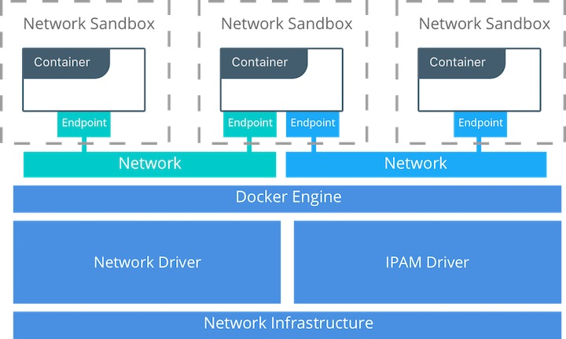
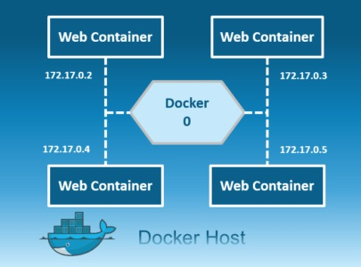
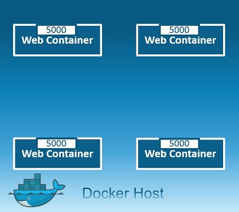
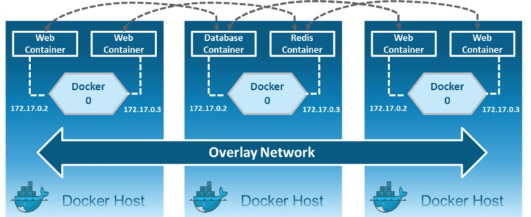
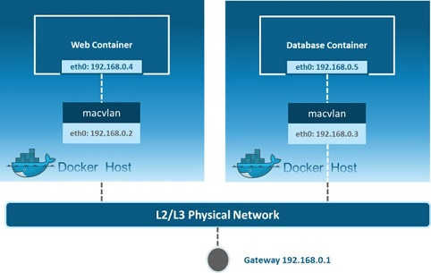
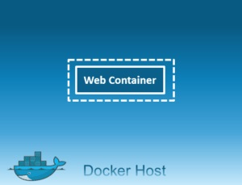
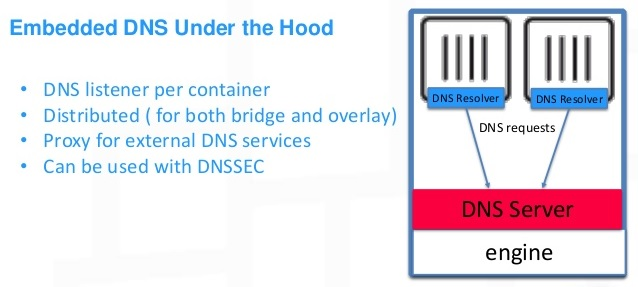
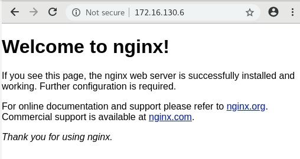

# Docker Networking

Individual containers, need to  communicate with each other through a network to perform the required actions, and this is nothing but Docker Networking.

You can define Docker Networking as a communication passage through which all the isolated containers communicate with each other in various situations to perform the required actions.

As Docker has developed a new way of delivering applications, and with that, containers have also changed some aspects of how networking is approached. 

Here are Challenges of Networking Containers :

* **Portability**
  * _How do I guarantee maximum portability across different network environments while taking advantage of unique network characteristics?_
* **Security**

  * _How do I segment to prevent the wrong containers from accessing each other?_
  * _How do I guarantee that a container with application and cluster control traffic is secure?_

  \*\*\*\*

* **Performance**

  * _How do I provide advanced network services while minimizing latency and maximizing bandwidth?_

  \*\*\*\*

* **Scalability**

  * _How do I ensure that none of these characteristics are sacrificed when scaling applications across many hosts?_

  \_\_

### **Container Network Model \(CNM\)**

 The Docker networking architecture is built on a set of interfaces called the _Container Networking Model_ \(CNM\). The philosophy of CNM is to provide application portability across **different** infrastructures. This model strikes a balance to achieve application portability and also takes advantage of special features and capabilities of the infrastructure.



#### CNM Constructs <a id="cnmconstructs"></a>

*  **Endpoint:** Provides the connectivity for services exposed by a container in a network with other services provided by other containers in the network. An endpoint represents a service and not necessarily a particular container, Endpoint has a global scope within a cluster as well.
* **Sandbox:** Created when users request to create an endpoint on a network. A Sandbox can have multiple endpoints attached to different networks representing container’s network configuration such as IP-address, MAC-address, routes, DNS.
*  **Network:**  Provides connectivity between a group of endpoints that belong to the same network and isolate from the rest. So, whenever a network is created or updated, the corresponding Driver will be notified of the event.

#### CNM Driver Interfaces <a id="cnmdriverinterfaces"></a>

The Container Networking Model provides two pluggable and open interfaces that can be used by users, the community, and vendors to add additional functionality, visibility, or control in the network.

*  the network plugin APIs are used to create/delete networks and add/remove containers from networks.
*   * **Native Network Drivers** — Native Network Drivers are a native part of the Docker Engine and are provided by Docker. There are multiple drivers to choose from that support different capabilities like overlay networks or local bridges.
  * **Remote Network Drivers** — Remote Network Drivers are network drivers created by the community and other vendors. These drivers can be used to provide integration with specific software and hardware. Users can also create their own drivers in cases where they desire specific functionality that is not supported by an existing network driver.

* The IPAM plugin APIs are used to create/delete address pools and allocate/deallocate container IP addresses.


Libnetwork is an open source Docker library which implements all of the key concepts that make up the CNM. 


### **Docker Native Network Drivers**

There are mainly 5 network drivers: Bridge, Host, None, Overlay, Macvlan:

 **Bridge:** The bridge network is a private default internal network created by docker on the host. So, all containers get an internal IP address and these containers can access each other, using this internal IP. The Bridge networks are usually used when your applications run in standalone containers that need to communicate.




The Docker server creates and configures the host system’s **docker0** interface as an Ethernet bridge inside the Linux kernel that could be used by the docker containers to communicate with each other and with the outside world, the default configuration of the **docker0** works for most of the scenarios but you could customize the **docker0** bridge based on your specific requirements.

The **docker0** **bridge** is virtual interface created by docker, it randomly chooses an address and subnet from the private range defined by RFC 1918 that are not in use on the host machine, and assigns it to **docker0**. All the docker containers will be connected to the **docker0** bridge by default, the docker containers connnected to the **docker0** bridge could use the iptables NAT rules created by docker to communicate with the outside world.


**Host**: This driver removes the network isolation between the docker host and the docker containers to use the host’s networking directly. So with this, you will not be able to run multiple web containers on the same host, on the same port as the port is now common to all containers in the host network.



 **Overlay**: Creates an internal private network that spans across all the nodes participating in the swarm cluster. So, Overlay networks facilitate communication between a swarm service and a standalone container, or between two standalone containers on different Docker Daemons.



 **Macvlan:** Allows you to assign a MAC address to a container, making it appear as a physical device on your network. Then, the Docker daemon routes traffic to containers by their MAC addresses. Macvlan driver is the best choice when you are expected to be directly connected to the physical network, rather than routed through the Docker host’s network stack.



**None**: In this kind of network, containers are not attached to any network and do not have any access to the external network or other containers. So, this network is used when you want to completely disable the networking stack on a container and, only create a loopback device.



Lets wrap it up:



Connects container to the LAN and other containers

* The default network type
* Great for most use cases



Remove network isolation between container and host

* Only one container \(or application on the host\) can use a port at the same time
* Useful for specific applications, such as management container that you want to run on every host



Connects multiple Docker hosts\(and their containers\) together and enable swarm

* Only available with Docker EE and Swarm enabled.
* Multihost networking using VXLAN



Assign a MAC address, appear as physical host

* Clones host interfaces to create virtual interfaces, available in the container.
* Supports connecting to VLANs.



Connects the container to an isolated network with only that container on it

* Container cannot communicate with any other networks or networked devices.



### Listing Docker Networks

```text
[root@earth ~]# docker network ls
NETWORK ID          NAME                DRIVER              SCOPE
b05ff920f0da        bridge              bridge              local
f34113b7dc6a        host                host                local
ba9b9833188b        none                null                local
```

as we are using Docker-CE there is no Overlay network. We can get detailed information about any of these networks using `docker network inspect`  command.

### Creating a bridge network

```text
[root@earth ~]# docker network create --driver bridge myapp-net
4c7a97493cf3b2c151966afa5a933859ba6b246862f1d05ac9030d9aaa4d70ac
```

```text
[root@earth ~]# docker network ls
NETWORK ID          NAME                DRIVER              SCOPE
b05ff920f0da        bridge              bridge              local
f34113b7dc6a        host                host                local
4c7a97493cf3        myapp-net           bridge              local
ba9b9833188b        none                null                local
```

so again we can user `docker network inspect myapp-net` to see details such as network subnet.

### Running container\(s\) on the bridge network

```text
[root@earth ~]# docker run -dit --name app1 --network myapp-net alpine 
Unable to find image 'alpine:latest' locally
latest: Pulling from library/alpine
df20fa9351a1: Pull complete 
Digest: sha256:185518070891758909c9f839cf4ca393ee977ac378609f700f60a771a2dfe321
Status: Downloaded newer image for alpine:latest
2ca2b7353e439a27390d363237ba166e9bb9f957748ec01455a3f17a4fc14afa
```

```text
[root@earth ~]# docker ps | grep alpine
2ca2b7353e43        alpine              "/bin/sh"           48 seconds ago      Up 47 seconds                           app1
```

use `docker network inspect myapp-net` in order to check the container\(s\) that are running on the myapp-net network, see the ip address.

Lets bring up another container app2 on myapp-net and check the communications between two containers:

```text
[root@earth ~]# docker run -dit --name app2 --network myapp-net alpine 
c353a85a7c70ff125815f817335abb98ebffa82f595878d20074aee8ed837f74
```

```text
[root@earth ~]# docker network inspect myapp-net
.
.
.
 "Containers": {
            "2ca2b7353e439a27390d363237ba166e9bb9f957748ec01455a3f17a4fc14afa": {
                "Name": "app1",
                "EndpointID": "edfcfafd5da16efe1524ce744f8dae3cec57dc7cf6e80aa922e7b28d5bcebb2a",
                "MacAddress": "02:42:ac:12:00:02",
                "IPv4Address": "172.18.0.2/16",
                "IPv6Address": ""
            },
            "c353a85a7c70ff125815f817335abb98ebffa82f595878d20074aee8ed837f74": {
                "Name": "app2",
                "EndpointID": "a2e0b13be62ae9813ed3d70d423f32031b57a3cef30eec78598684f0459cbfdd",
                "MacAddress": "02:42:ac:12:00:03",
                "IPv4Address": "172.18.0.3/16",
                "IPv6Address": ""
            }
        },
        "Options": {},
        "Labels": {}
    }
```

attach to app1 and pinging app2 :

```text
[root@earth ~]# docker attach app1
/ # hostname
2ca2b7353e43
/ # ping 172.18.0.3
PING 172.18.0.3 (172.18.0.3): 56 data bytes
64 bytes from 172.18.0.3: seq=0 ttl=64 time=0.191 ms
64 bytes from 172.18.0.3: seq=1 ttl=64 time=0.057 ms
64 bytes from 172.18.0.3: seq=2 ttl=64 time=0.142 ms
^C
--- 172.18.0.3 ping statistics ---
3 packets transmitted, 3 packets received, 0% packet loss
round-trip min/avg/max = 0.057/0.130/0.191 ms
/ # 
/ # ping app2
PING app2 (172.18.0.3): 56 data bytes
64 bytes from 172.18.0.3: seq=0 ttl=64 time=0.087 ms
64 bytes from 172.18.0.3: seq=1 ttl=64 time=0.103 ms
64 bytes from 172.18.0.3: seq=2 ttl=64 time=0.132 ms
^C
--- app2 ping statistics ---
3 packets transmitted, 3 packets received, 0% packet loss
round-trip min/avg/max = 0.087/0.107/0.132 ms
/ # 
/ # 
```

_How to get out without stopping the container ? ctrl+p and then ctrl+q._

### Docker Embeded DNS

Containers can reach each other using their names

All containers in a docker host can resolve each other with the name of the container, docker has a built in DNS server that helps the containers to resolve each other using the container name. Built in DNS server always run at address 127.0.0.11.



As there is no guarantee that containers get the same ip when system reboots, using the container's name it the right way of calling other apps inside other containers.

### Removing a docker network

```text
[root@earth ~]# docker network remove myapp-net
Error response from daemon: error while removing network: network myapp-net id 4c7a97493cf3b2c151966afa5a933859ba6b246862f1d05ac9030d9aaa4d70ac has active endpoints
```

before removing a network we have to make sure there are no running container on that network so first:

```text
[root@earth ~]# docker container  stop app1 app2
app1
app2
```

```text
[root@earth ~]# docker network remove myapp-net
myapp-net
[root@earth ~]# docker network ls
NETWORK ID          NAME                DRIVER              SCOPE
b05ff920f0da        bridge              bridge              local
f34113b7dc6a        host                host                local
ba9b9833188b        none                null                local
```

 `docker network prune` will remove all unused networks.


**Good to know**

* By default, containers have outbound network access but no inbound network access.
* Ports must be published to allow inbound network access.


### Publishing ports

 By default, when you create a container, it does not publish any of its ports to the outside world. To make a port available to services outside of Docker, or to Docker containers which are not connected to the container’s network, use the `--publish` or `-p` flag. This creates a firewall rule which maps a container port to a port on the Docker host. Here are some examples:

| Flag value | Description |
| :--- | :--- |
| `-p 8080:80` | Map TCP port 80 in the container to port 8080 on the Docker host. |
| `-p 192.168.1.100:8080:80` | Map TCP port 80 in the container to port 8080 on the Docker host for connections to host IP 192.168.1.100. |
| `-p 8080:80/udp` | Map UDP port 80 in the container to port 8080 on the Docker host. |
| `-p 8080:80/tcp -p 8080:80/udp` | Map TCP port 80 in the container to TCP port 8080 on the Docker host, and map UDP port 80 in the container to UDP port 8080 on the Docker host. |

```text
[root@earth ~]# docker container run -dit -p 8080:80 --name web1 nginx
0cbb21df8668e518a002282b315fa9fea64d91de4af5ed82ee4bd5eea13324e6

[root@earth ~]# docker ps
CONTAINER ID        IMAGE               COMMAND                  CREATED             STATUS              PORTS                  NAMES
0cbb21df8668        nginx               "nginx -g 'daemon of…"   7 seconds ago       Up 7 seconds        0.0.0.0:8080->80/tcp   web1
```

If you provide the `-P` \(NOTE: the letter is upper-case\) option when running your container, it will bind each exposed port to a _random ports_ of the host.

```text
[root@earth ~]# docker container run -dit -P --name web2 nginx
ec7f08b84e2d1c105b367caf5bee5547760ac0f1bc193383e492bb6c3871bae9

[root@earth ~]# docker ps
CONTAINER ID        IMAGE               COMMAND                  CREATED             STATUS              PORTS                   NAMES
ec7f08b84e2d        nginx               "nginx -g 'daemon of…"   3 seconds ago       Up 1 second         0.0.0.0:32768->80/tcp   web2
0cbb21df8668        nginx               "nginx -g 'daemon of…"   26 minutes ago      Up 26 minutes       0.0.0.0:8080->80/tcp    web1

```

### Configuring DNS

 By default, a container inherits the DNS settings of the host, as defined in the `/etc/resolv.conf` configuration file. Containers that use the default `bridge` network get a copy of this file, whereas containers that use a custom network use Docker’s embedded DNS server, which forwards external DNS lookups to the DNS servers configured on the host.

If we want a container to use specific DNS server we have  a couple of different ways to go about this:

1. **Using --dns flag  while run a container:**

```text
[root@earth ~]# docker container run -it --dns 172.16.40.70 centos /bin/bash
Unable to find image 'centos:latest' locally
latest: Pulling from library/centos
6910e5a164f7: Pull complete 
Digest: sha256:4062bbdd1bb0801b0aa38e0f83dece70fb7a5e9bce223423a68de2d8b784b43b
Status: Downloaded newer image for centos:latest
[root@81effa9b054b /]# 
[root@81effa9b054b /]# cat /etc/resolv.conf 
nameserver 172.16.40.70
[root@81effa9b054b /]# 
```

    _ctrk+d to exit_  and lets check it again with out specifying DNS Server:

```text
[root@earth ~]# docker container run -it  centos /bin/bash
[root@765ea2095dca /]# 
[root@765ea2095dca /]# cat /etc/resolv.conf 
# Generated by NetworkManager
nameserver 8.8.8.8
[root@765ea2095dca /]# 
```

and it has taken my Docker host DNS server settings. Please note that  Custom hosts defined in `/etc/hosts` are not inherited. To pass additional hosts into your container, refer to add entries to container hosts file in the `docker run.`

**2. creating /etc/docker/daemon.json file:**

it would actually infect intire docker host:

```text
[root@earth ~]# vim /etc/docker/daemon.json
```

put the desired DNS server\(s\) in there:

```text
{
"dns": ["1.1.1.1"]
}
```

restarting docker service and check the results:

```text
[root@earth ~]# systemctl restart docker.service 
[root@earth ~]#
[root@earth ~]# docker container run -it  centos /bin/bash
[root@07c55ff02b36 /]# 
[root@07c55ff02b36 /]# cat /etc/resolv.conf 
nameserver 1.1.1.1
[root@07c55ff02b36 /]# 
```

### Creating a host network

The concept of host network is very simple, instead of a container running and then having some  sort of network address translation that you may or may not configure between the host and  the container\(s\) , with host network the container runs and it is utilizing the physical interface of the host network. So no NAT, no port to configure, that container is directly on host physical network.

```text
[root@earth ~]# docker container run -d --network host nginx
50d79130ab8cd8e96758756b7920b64d4675be262cc1e2250c7b06c066fdd07f

[root@earth ~]# docker ps
CONTAINER ID        IMAGE               COMMAND                  CREATED             STATUS              PORTS               NAMES
50d79130ab8c        nginx               "nginx -g 'daemon of…"   5 seconds ago       Up 4 seconds                            determined_leavitt
```

and actually there are not private to public port mapping, it is directly on the host network:

```text
[root@earth ~]# 
[root@earth ~]# docker container port determined_leavitt
[root@earth ~]# 
```

 open a web browser and go to your docker host ip address:



.

.

_--------_

with the special thanks of David Davis .

\_\_[https://success.docker.com/article/networking](https://success.docker.com/article/networking)

\_\_[https://www.edureka.co/blog/docker-networking/](https://www.edureka.co/blog/docker-networking/)

[https://developer.ibm.com/recipes/tutorials/networking-your-docker-containers-using-docker0-bridge/\#:~:text=The%20docker0%20bridge%20is%20virtual,and%20assigns%20it%20to%20docker0.](https://developer.ibm.com/recipes/tutorials/networking-your-docker-containers-using-docker0-bridge/#:~:text=The%20docker0%20bridge%20is%20virtual,and%20assigns%20it%20to%20docker0.)

[https://www.slideshare.net/Docker/docker-networking-0-to-60mph-slides](https://www.slideshare.net/Docker/docker-networking-0-to-60mph-slides)

\_\_[https://vsupalov.com/docker-expose-ports/](https://vsupalov.com/docker-expose-ports/)

[https://docs.docker.com/config/containers/container-networking/](https://docs.docker.com/config/containers/container-networking/)

_._

\_\_

