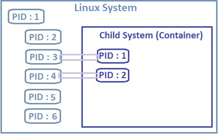
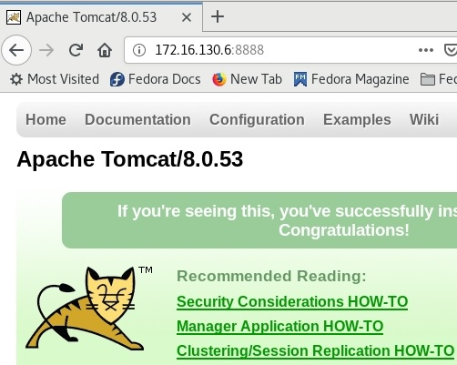
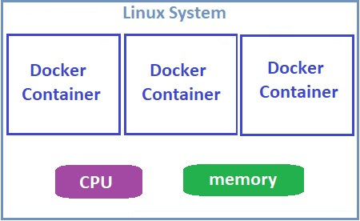

# Docker Security

Docker is used more and more  in recent years and it has made container security a critical consideration for organizations that use containers for development or production. Also it should be noticed that containers are more complex in many respects than virtual machines, learning how to secure Docker containers can be complex as well.

Docker container security is more complicated, largely because a typical Docker environment has many more moving parts. Those parts include:

* Your containers. You probably have multiple images, and You probably also have multiple instances of each image running at a given time. Each of those images and instances needs to be secured and monitored separately.
* The Docker daemon, which needs to be secured to keep the containers it hosts safe.
* The host server, which could be bare metal or a virtual machine.
* If you host your containers in the cloud using a service like ECS or GCP , that is another layer to secure.
* Overlay networks and APIs that facilitate communication between containers.
* Data volumes or other storage systems that exist externally from your containers.

## Default Docker Engine Security

Now lets see how docker engine provides security:

### Kernel namespaces <a id="kernel-namespaces"></a>

docker uses namespace to isolate workspace process ids, network, inter process communication, mounts and unix time sharing systems are created in their own namespace thereby providing isolation between containers. For example lets take look at isolation betwwen PID :



Processes running inside the container are in fact process running on the underlying host. And so two processes can not have the same process IDs. This is where namespace is come into play. With process ID namespaces each process can have multiple process ides associated with it.

For demostration lets run tomcat docker container and put it in background:

```text
[root@earth ~]# docker run -d --rm -p 8888:8080 tomcat:8.0
Unable to find image 'tomcat:8.0' locally
8.0: Pulling from library/tomcat
f189db1b88b3: Downloading [=======================>                           ]  25.76MB/54.25MB
3d06cf2f1b5e: Downloading [==========================================>        ]  15.07MB/17.54MB
edd0da9e3091: Download complete 
eb7768aae14e: Download complete 
.
.
.
1aea3d9a32e6: Pull complete 
Digest: sha256:8ecb10948deb32c34aeadf7bf95d12a93fbd3527911fa629c1a3e7823b89ce6f
Status: Downloaded newer image for tomcat:8.0
da3567e800459cb2d819c0d0d3a3a30b4f8bab01bc82e016895601dc58ce1c58
[root@earth ~]# docker ps
CONTAINER ID        IMAGE               COMMAND             CREATED             STATUS              PORTS                    NAMES
da3567e80045        tomcat:8.0          "catalina.sh run"   8 seconds ago       Up 6 seconds        0.0.0.0:8888->8080/tcp   condescending_hugle
[root@earth ~]# 
```

and it is running:



now lets compare running  processes between docker container and docker host:

```text
[root@earth ~]# docker exec da3567e80045 ps -eaf
UID        PID  PPID  C STIME TTY          TIME CMD
root         1     0  0 08:22 ?        00:00:05 /docker-java-home/jre/bin/java -Djava.util.logging.config.file=/usr/local/tomcat/conf/logging.properties -Djava.util.logging.manager=org.apache.juli.ClassLoaderLogManager -Djdk.tls.ephemeralDHKeySize=2048 -Djava.protocol.handler.pkgs=org.apache.catalina.webresources -Dignore.endorsed.dirs= -classpath /usr/local/tomcat/bin/bootstrap.jar:/usr/local/tomcat/bin/tomcat-juli.jar -Dcatalina.base=/usr/local/tomcat -Dcatalina.home=/usr/local/tomcat -Djava.io.tmpdir=/usr/local/tomcat/temp org.apache.catalina.startup.Bootstrap start
root        58     0  0 08:34 ?        00:00:00 ps -eaf
```

```text
[root@earth ~]# ps -eaf | grep "docker-java-home"
root      4231  4216  0 12:52 ?        00:00:05 /docker-java-home/jre/bin/java -Djava.util.logging.config.file=/usr/local/tomcat/conf/logging.properties -Djava.util.logging.manager=org.apache.juli.ClassLoaderLogManager -Djdk.tls.ephemeralDHKeySize=2048 -Djava.protocol.handler.pkgs=org.apache.catalina.webresources -Dignore.endorsed.dirs= -classpath /usr/local/tomcat/bin/bootstrap.jar:/usr/local/tomcat/bin/tomcat-juli.jar -Dcatalina.base=/usr/local/tomcat -Dcatalina.home=/usr/local/tomcat -Djava.io.tmpdir=/usr/local/tomcat/temp org.apache.catalina.startup.Bootstrap start
root      5422  2379  0 13:05 pts/6    00:00:00 grep --color=auto docker-java-home

```

so with namesapces we are able to give multiple process IDs to the same process and making the container think that it is a root process of that particular container whereas infact it is just another process running on the underlying docker host.

### Control Groups

We have learned that the underlying docker host and the containers shared the same system resources such as CPU and memory.   How much of the resources are dedicated to the host and the containers? How does Docker manage and share resources between the containers? 



By default there is no restriction on the resources that a container can use and consequently a container may end up utilizing all of the resources on the underlying host.  This essentially causes the **denial-of-service** attacks or the total system shutdown in cases of resource exploitation by a single container.

Docker uses cgroups \(control groups\)  to restrict the amount of CPU or memory a container can use . For example:

```text
docker run --cpus=.5 ubuntu
```

The above command will ensure that the container does not take up more that 50% of the host CPU at any given time. The same goes with memory:

```text
docker run --memory=500m ubuntu
```

limits the amount of memory that container can use to 500 megabytes.

### Docker Daemon Attack Surface

 Running containers \(and applications\) with Docker implies running the Docker daemon. This daemon requires `root` privileges unless you opt-in to Rootless mode \(experimental\), and you should therefore be aware of some important details.

*  First of all, **only trusted users should be allowed to control your Docker daemon**. This is a direct consequence of some powerful Docker features. Specifically, Docker allows you to share a directory between the Docker host and a guest container; and it allows you to do so without limiting the access rights of the container. This means that you can start a container where the `/host` directory is the `/` directory on your host; and the container can alter your host filesystem without any restriction. 
*  **The daemon is also potentially vulnerable to other inputs**, such as image loading from either disk with `docker load`, or from the network with `docker pull`. As of Docker 1.3.2, images are now extracted in a chrooted subprocess on Linux/Unix platforms, being the first-step in a wider effort toward privilege separation. As of Docker 1.10.0, all images are stored and accessed by the cryptographic checksums of their contents, limiting the possibility of an attacker causing a collision with an existing image.
* Finally, **if you run Docker on a server, it is recommended to run exclusively Docker on the server, and move all other services within containers controlled by Docker**. Of course, it is fine to keep your favorite admin tools \(probably at least an SSH server\), as well as existing monitoring/supervision processes, such as NRPE and collectd.

### Linux Kernel Capabilities

By default, Docker starts containers with a restricted set of capabilities. What does that mean?

 It means that all the processes running inside a container will not be given the "**root**" capabilities. Processes like web servers, which connect to port 1024, will not need any root access.  They can be just given the **net\_bind\_service** instead. Similarly, the processes will be given the root privilege only in case of the need.

 Typically, servers run several processes as root by default, including the _SSH daemon, cron daemon, logging daemons, kernel modules, network configuration tools_, etc. However, a container works differently, with restricted root privilege, as almost all the important tasks will be handled by the infrastructure around. This restricted root access in containers reduces the vectors of attack by malicious users, considerably.

.

.

.

-----

[https://resources.whitesourcesoftware.com/blog-whitesource/docker-container-security-challenges-and-best-practices](https://resources.whitesourcesoftware.com/blog-whitesource/docker-container-security-challenges-and-best-practices)

[https://docs.docker.com/engine/security/security/](https://docs.docker.com/engine/security/security/)

[https://mindmajix.com/docker/docker-security\#:~:text=By%20default%2C%20Docker%20runs%20the,not%20need%20any%20root%20access.](https://mindmajix.com/docker/docker-security#:~:text=By%20default%2C%20Docker%20runs%20the,not%20need%20any%20root%20access.)

.

