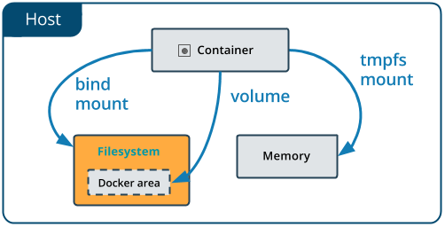

# Docker Storage and volumes

Docker containers runs your applications, those applications need data and that data need to be stored some where.  You as a docker administrator need to know manage docker storage and volumes.

## Manage data in Docker

By default all files created inside a container are stored on a writable container layer, but data should not be stored inside the container! because  there are some issues with that  :

* Containers are designed to be ephemeral \(disposable\)
* When containers are stopped, data is not accessible.
* Containers are typically stored on each host
* The container file system wasn't designed for high performance I/O.

 Docker has two options for containers to store files in the host machine, so that the files are persisted even after the container stops: _**volumes**_, and _**bind mounts**_. 


If you’re running Docker on Linux you can also use a _tmpfs mount_. If you’re running Docker on Windows you can also use a _named pipe_.


1. **Volumes** : The recommended way to persist data, stored at /var/lib/docker/volumes/
2. **Bind Mounts**: have limited functionality and you must use the exact file path on the host; \(volumes recommended\)
3. **tmpfs** mounts: Stored only in a host's memory in Linux \(least recommended\) 


## Docker storage drivers

In fact, in docker we are not writing to container's writable layer, instead we are using docker volumes. For doing that  storage driver is needed . Storage driver manage filesystem behind the scenes. There are different storage drivers that we can plug in and plug out:

* overlay , overlay2
* aufs
* devicemapper
* btrfs
* zfs

 Depending on the linux distribution we are using different storage drivers is recommended \(always check docs.docker.com for latest updates\):

| Linux distribution | Recommended storage drivers | Alternative drivers |
| :--- | :--- | :--- |
| Docker CE on ubuntu | overlay2 or aufs \(for Ubuntu 14.04 running on kernel 3.13\) | overlay, devicemapper, zfs, vfs |
| Docker CE on Debian | overlay2 \(Debian Stretch\), aufs or devicemapper \(older versions\) | overlay, vfs |
| Docker CE on CentOS | overlay2 | overlay, devicemapper, zfs, vfs |
| Docker CE on Fedora | overlay2 | overlay, devicemapper , zfs, vfs |


Important: When you change the storage driver, any existing images and containers become inaccessible. This is because their layers cannot be used by the new storage driver. If you revert your changes, you can access the old images and containers again, but any that you pulled or created using the new driver are then inaccessible.


use `docker info | less` command to see which storage driver is currently running.

```text
 [root@earth~]#docker info
...
 Storage Driver: overlay2
 Docker Root Dir: /var/lib/docker
...
```

## Use volumes

Volumes are the preferred mechanism for persisting data generated by and used by Docker containers. While bind mounts are dependent on the directory structure of the host machine, volumes are completely managed by Docker. Volumes have several advantages over bind mounts:

* Volumes are easier to back up or migrate than bind mounts.
* You can manage volumes using Docker CLI commands or the Docker API.
* Volumes work on both Linux and Windows containers.
* Volumes can be more safely shared among multiple containers.
* Volume drivers let you store volumes on remote hosts or cloud providers, to encrypt the contents of volumes, or to add other functionality.
* New volumes can have their content pre-populated by a container.

In addition, volumes are often a better choice than persisting data in a container’s writable layer, because a volume does not increase the size of the containers using it, and the volume’s contents exist outside the lifecycle of a given container.


### **Create a volume**:

```text
[root@earth ~]# docker volume create my-vol
my-vol
```

### **List volumes**:

```text
[root@earth ~]# docker volume ls
DRIVER              VOLUME NAME
local               8137730e7356621d3075c51b80c7838fd987b0ac34f586c035cf66eb2a9af6ed
local               my-vol
```

get more information about a volume by using `docker volume inspect my-vol` command.

### Remove a volume

```text
[root@earth ~]# docker volume rm my-vol
my-vol
```

### Start a container with a volume <a id="start-a-container-with-a-volume"></a>

If you start a container with a volume that does not yet exist, Docker creates the volume for you. The following example mounts the volume `myvol2` into `/app/` in the container.

The `-v` and `--mount` examples below produce the same result.



```text
$ docker run -d \
  --name devtest \
  --mount source=myvol2,target=/app \
  nginx:latest
```

 Use `docker inspect devtest` to verify that the volume was created and mounted correctly. Look for the `Mounts` section.



```text
$ docker run -d \
  --name devtest \
  -v myvol2:/app \
  nginx:latest
```

 Use `docker inspect devtest` to verify that the volume was created and mounted correctly. Look for the `Mounts` section.




**Choose the -v or --mount flag** 

Originally, the -v or --volume flag was used for standalone containers and the --mount flag was used for swarm services. However, starting with Docker 17.06, you can also use --mount with standalone containers. In general, --mount is more explicit and verbose. The biggest difference is that the -v syntax combines all the options together in one field, while the --mount syntax separates them. [Here ](https://docs.docker.com/storage/volumes/)is a comparison of the syntax for each flag.

_New users should try --mount syntax which is simpler than --volume syntax._



**Differences between `-v` and `--mount` behavior**

As opposed to bind mounts, all options for volumes are available for both `--mount` and `-v` flags.


For removing Stop the container and remove the volume. Note volume removal is a separate step.

```text
$ docker container stop devtest

$ docker container rm devtest

$ docker volume rm myvol2
```


The `docker export` command does not export the contents of volumes associated with the container. If a volume is mounted on top of an existing directory in the container, `docker export` will export the contents of the _underlying_ directory, not the contents of the volume.

Refer to [Backup, restore, or migrate data volumes](https://docs.docker.com/v17.03/engine/tutorials/dockervolumes/#backup-restore-or-migrate-data-volumes) in the user guide for examples on exporting data in a volume.


### Use bind  mounts

Bind mounts have been around since the early days of Docker. Bind mounts have limited functionality compared to volumes. When you use a bind mount, a file or directory on the host machine is mounted into a container. The file or directory is referenced by its full or relative path on the host machine. By contrast, when you use a volume, a new directory is created within Docker’s storage directory on the host machine, and Docker manages that directory’s contents.

The file or directory does not need to exist on the Docker host already. It is created on demand if it does not yet exist. Bind mounts are very performant, but they rely on the host machine’s filesystem having a specific directory structure available. If you are developing new Docker applications, consider using named volumes instead. You can’t use Docker CLI commands to directly manage bind mounts.





```text
$ docker run -d \
  -it \
  --name devtest \
  --mount type=bind,source="$(pwd)"/target,target=/app \
  nginx:latest
```

 Use `docker inspect devtest` to verify that the bind mount was created correctly. Look for the `Mounts` section:



```text
$ docker run -d \
  -it \
  --name devtest \
  -v "$(pwd)"/target:/app \
  nginx:latest
```

 Use `docker inspect devtest` to verify that the bind mount was created correctly. Look for the `Mounts` section




### Choose the -v or --mount flag <a id="choose-the--v-or---mount-flag"></a>

Originally, the `-v` or `--volume` flag was used for standalone containers and the `--mount` flag was used for swarm services. However, starting with Docker 17.06, you can also use `--mount` with standalone containers. In general, `--mount` is more explicit and verbose. The biggest difference is that the `-v` syntax combines all the options together in one field, while the `--mount` syntax separates them. [Here ](https://docs.docker.com/storage/bind-mounts/)is a comparison of the syntax for each flag.

 _**Tip**: New users should use the `--mount` syntax. Experienced users may be more familiar with the `-v` or `--volume` syntax, but are encouraged to use `--mount`, because research has shown it to be easier to use._



#### Differences between `-v` and `--mount` behavior <a id="differences-between--v-and---mount-behavior"></a>

Because the `-v` and `--volume` flags have been a part of Docker for a long time, their behavior cannot be changed. This means that **there is one behavior that is different between `-v` and `--mount`.**

* If you use `-v` or `--volume` to bind-mount a file or directory that does not yet exist on the Docker host, `-v` creates the endpoint for you. **It is always created as a directory.**
* If you use `--mount` to bind-mount a file or directory that does not yet exist on the Docker host, Docker does **not** automatically create it for you, but generates an error.


.

------

with the special thanks of David Davis .

[https://docs.docker.com/storage/storagedriver/select-storage-driver/](https://docs.docker.com/storage/storagedriver/select-storage-driver/)

[https://docs.docker.com/storage/volumes/](https://docs.docker.com/storage/volumes/)

[https://docs.docker.com/storage/bind-mounts/](https://docs.docker.com/storage/bind-mounts/)

.

